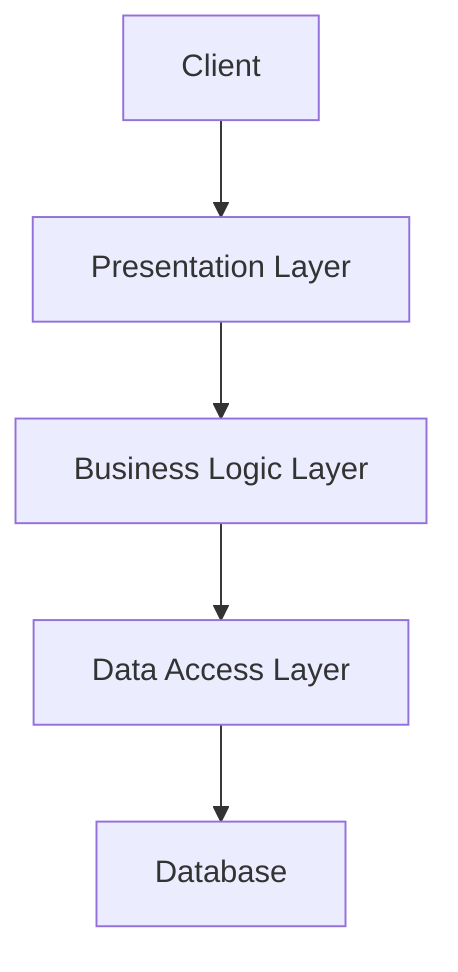

# 1. Foundational Concepts in High-Level Design (HLD)

## Introduction to High-Level Design (HLD)

High-Level Design (HLD) is the process of defining the overall architecture and structure of a software system. It focuses on how the system will be organized, what major components it will have, and how these components will interact.

**Key Points:**

- Provides a blueprint for the system.
- Bridges the gap between requirements and detailed design (LLD).
- Helps stakeholders visualize the system.

---

## HLD vs LLD

| Aspect       | HLD (High-Level Design)          | LLD (Low-Level Design)   |
| ------------ | -------------------------------- | ------------------------ |
| Focus        | Architecture, modules, data flow | Classes, methods, logic  |
| Audience     | Architects, stakeholders         | Developers               |
| Detail Level | Abstract, big picture            | Detailed, implementation |

---

## Purpose of HLD in Software Architecture

- Ensures all stakeholders have a shared understanding.
- Identifies major components and their responsibilities.
- Guides technology choices and system boundaries.

---

## Understanding System Architecture

### Monolithic Architecture

- All components are part of a single codebase and deployed as one unit.
- **Pros:** Simple to develop and deploy initially.
- **Cons:** Hard to scale, maintain, or update parts independently.

**Java Example:**

```java
public class MonolithicApp {
    public static void main(String[] args) {
        UserController userController = new UserController();
        userController.handleRequest();
    }
}
```

### Microservices Architecture

- Each feature is a separate service, often with its own database.
- **Pros:** Scalable, independent deployments, technology diversity.
- **Cons:** Complex to manage, requires DevOps and monitoring.

**Java Example (Spring Boot):**

```java
@RestController
public class UserService {
    @GetMapping("/users/{id}")
    public User getUser(@PathVariable String id) {
        // Fetch user from DB
    }
}
```

### Layered Architecture

- Divides system into layers: Presentation, Business Logic, Data Access.
- Each layer has a specific responsibility.

**Java Example:**

```java
// Presentation Layer
public class UserController {
    private UserService userService = new UserService();
    public void handleRequest() {
        userService.processUser();
    }
}
// Business Logic Layer
public class UserService {
    public void processUser() {
        // Business logic here
    }
}
// Data Access Layer
public class UserRepository {
    public User findUserById(String id) {
        // DB access here
    }
}
```

### Client-Server Architecture

- Clients (UI) interact with backend servers via APIs.

**Java Example (REST API):**

```java
@RestController
public class ProductController {
    @GetMapping("/products")
    public List<Product> getProducts() {
        // Return product list
    }
}
```

### Event-Driven Architecture

- Components communicate via events (messages).
- Decouples producers and consumers.

**Java Example (Spring Boot + Kafka):**

```java
// Producer
@Autowired
private KafkaTemplate<String, String> kafkaTemplate;
public void sendEvent(String event) {
    kafkaTemplate.send("events", event);
}
// Consumer
@KafkaListener(topics = "events")
public void listen(String event) {
    // Handle event
}
```

---

## Understanding Scalability

### Vertical Scaling

- Add more resources (CPU, RAM) to a single server.
- **Limitation:** Physical hardware limits.

### Horizontal Scaling

- Add more servers to distribute load.
- **Java Example:** Deploying multiple instances of a Spring Boot app behind a load balancer.

### Load Balancing

- Distributes incoming requests across multiple servers.

**Java Example (Pseudo):**

```java
// Not actual Java code, but conceptually:
// Load balancer forwards requests to available app instances
```

### Elasticity in Cloud Architectures

- Automatically scale resources up/down based on demand (e.g., AWS Auto Scaling).

---

## System Components & Their Roles

### Frontend

- User interface, often built with JavaScript frameworks (React, Angular).

### Backend

- Business logic, APIs (e.g., Java Spring Boot).

**Java Example:**

```java
@RestController
public class OrderController {
    @PostMapping("/orders")
    public Order createOrder(@RequestBody Order order) {
        // Business logic
    }
}
```

### Database

- Stores persistent data (e.g., MySQL, MongoDB).

### Caching Layer

- Provides fast access to frequently used data (e.g., Redis).

**Java Example (Spring Cache):**

```java
@Cacheable("users")
public User getUser(String id) {
    // Fetch from DB if not in cache
}
```

### Third-Party Services/Integrations

- Payment gateways, email APIs, etc.

**Java Example (REST call):**

```java
RestTemplate restTemplate = new RestTemplate();
String response = restTemplate.getForObject("https://api.example.com/data", String.class);
```

### Message Queues and Event Brokers

- Enable asynchronous communication (e.g., RabbitMQ, Kafka).

**Java Example (RabbitMQ):**

```java
@Autowired
private RabbitTemplate rabbitTemplate;
public void sendMessage(String msg) {
    rabbitTemplate.convertAndSend("queueName", msg);
}
```

---

## Diagram: Layered Architecture (Mermaid)



---

**Summary:**

- HLD provides the big-picture view of a system.
- Understanding different architectures and components is crucial for scalable, maintainable systems.
- Java code samples help relate concepts to real-world implementations.
