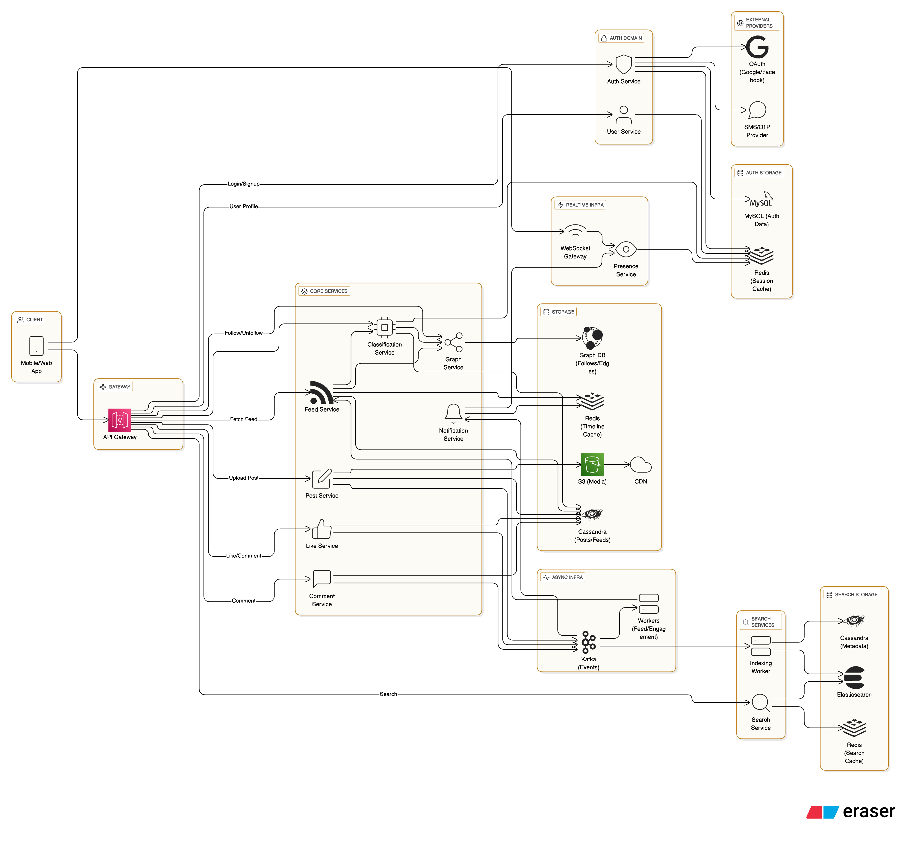

# Design Instagram – Media Sharing Platform

## 📋 Problem Statement

Design a large-scale media sharing platform like Instagram that allows users to:

- Upload, view, and share photos and videos
- Follow other users and view their posts in a feed
- Like, comment, and save posts
- Create and view ephemeral stories
- Discover content via search, hashtags, and recommendations
- Receive notifications for relevant activities
- Ensure high availability, scalability, and security

## 🎯 Functional Requirements

### Core Features

1. **User Management**: Registration, authentication, profiles, follow/unfollow
2. **Media Upload & Storage**: Upload, store, and serve images/videos
3. **Feed Generation**: Personalized timeline of posts from followed users
4. **Stories**: Ephemeral media (24-hour expiry), story highlights
5. **Likes, Comments, Saves**: Interact with posts, view engagement
6. **Search & Discovery**: Search users, hashtags, explore trending content
7. **Notifications**: Real-time and batch notifications for likes, comments, follows, etc.
8. **Direct Messaging**: (Optional) Private chat between users

### Non-Functional Requirements

- **Availability**: 99.9% uptime
- **Latency**: < 200ms for feed load, < 1s for uploads
- **Scalability**: 100M+ users, 1B+ posts, global access
- **Consistency**: Eventual for feed, strong for likes/comments
- **Security**: Data privacy, access control, abuse prevention

## 🏗️ System Architecture

### High-Level Architecture

#### 1. User Flow (Authentication, Profile, Follow System)
````mermaid
graph TD

  %% ------------------ Client Layer ------------------
  subgraph Client
    A1[Mobile/Web App]
  end

  %% ------------------ API Gateway ------------------
  subgraph Gateway
    A2[API Gateway]
  end

  A1 --> A2

  %% ------------------ Auth Domain ------------------
  subgraph Auth Domain
    B1[Auth Service]
    B2[User Service]
  end

  subgraph External Providers
    E1[OAuth (Google/Facebook)]
    E2[SMS/OTP Provider]
  end

  subgraph Auth Storage
    D1[(MySQL - Auth Data)]
    D3[(Redis - Session Cache)]
  end

  A2 -->|Login/Signup| B1
  B1 --> D1
  B1 --> E1
  B1 --> E2
  B1 --> D3
  A2 -->|User Profile| B2
  B2 --> D3

  %% ------------------ Core Services ------------------
  subgraph Core Services
    P1[Post Service]
    F1[Feed Service]
    L1[Like Service]
    C1[Comment Service]
    N1[Notification Service]
    G1[Graph Service]
    CL1[Classification Service]
  end

  %% ------------------ Storage Layer ------------------
  subgraph Storage
    S1[(Cassandra - Posts/Feeds)]
    S2[(Redis - Timeline Cache)]
    S3[(S3 - Media)]
    S4[(CDN)]
    S5[(Graph DB - Follows/Edges)]
  end

  %% ------------------ Async / Event Infra ------------------
  subgraph Async Infra
    K1[Kafka - Events]
    W1[Workers - Feed/Engagement]
  end

  %% ------------------ Presence & WebSocket ------------------
  subgraph Realtime Infra
    WS1[WebSocket Gateway]
    PR1[Presence Service]
  end

  A1 --> WS1
  WS1 --> PR1
  PR1 --> D3

  %% ------------------ Media Flow ------------------
  A2 -->|Upload Post| P1
  P1 --> S1
  P1 --> S3 --> S4
  P1 --> K1

  %% ------------------ Feed Flow ------------------
  A2 -->|Fetch Feed| F1
  F1 --> S2
  F1 --> S1
  F1 --> G1
  F1 --> CL1

  K1 --> W1
  W1 --> F1

  %% ------------------ Engagement Flow ------------------
  A2 -->|Like/Comment| L1
  A2 -->|Comment| C1
  L1 --> S1
  C1 --> S1
  L1 --> K1
  C1 --> K1

  K1 --> N1
  N1 --> PR1
  N1 --> S2

  %% ------------------ Graph and Classification ------------------
  A2 -->|Follow/Unfollow| G1
  G1 --> S5
  CL1 --> D3
  CL1 --> S1
  CL1 --> G1

  %% ------------------ Search & Indexing ------------------
  subgraph Search Services
    SE1[Search Service]
    SE2[Indexing Worker]
  end

  subgraph Search Storage
    ES1[(Elasticsearch)]
    ES2[(Cassandra - Metadata)]
    ES3[(Redis - Search Cache)]
  end

  A2 -->|Search| SE1
  SE1 --> ES1
  SE1 --> ES3
  C1 --> K1 --> SE2
  SE2 --> ES1
  SE2 --> ES2
````



### Core Components

---

#### 1. **API Gateway**
- Entry point for all client traffic (Web, Mobile)
- Responsibilities:
  - Routing to backend microservices
  - Authentication/authorization
  - Rate limiting, metrics, and request logging
---

#### 2. **Auth Service**
- Handles user login/signup with:
  - OAuth (Google, Facebook, Apple)
  - SMS/OTP providers
- Issues session tokens (JWT, access/refresh tokens)
- Integrates with Redis for session caching

---

#### 3. **User Service**
- Manages user profiles, bios, and preferences
- Handles username validation, email updates, etc.
- Works with:
  - Graph Service for followers/following
  - Classification Service for dynamic user attributes

---

#### 4. **Media Service**
- Manages:
  - Uploading, validation, resizing, compression
  - Transcoding for video formats
  - Thumbnail and preview generation
- Stores assets in:
  - Object storage (S3, GCS)
  - Global CDN for delivery

---

#### 5. **Feed Service**
- Builds the user feed based on follows and engagement
- Supports:
  - **Fan-out on write**: Precompute feeds
  - **Fan-out on read**: Build feeds on request
- Reads from:
  - Post Service, Graph Service, Classification Service
- Caches hot timelines in Redis

---

#### 6. **Story Service**
- Handles ephemeral stories (24-hour expiry)
- Features:
  - Story views, reactions
  - Highlights and archiving
- Integrates with Media Service for story content

---

#### 7. **Post Service**
- Handles post creation, editing, deletion
- Links media via Media Service
- Stores structured content (text, tags, captions) in Cassandra

---

#### 8. **Like/Comment Service**
- Manages:
  - Likes, comments, replies, post saves
- Ensures strong consistency
- Publishes engagement events to Kafka
- Includes moderation hooks (abuse/spam detection)

---

#### 9. **Graph Service**
- Manages social graph (follow, unfollow, mute, block)
- Stores relationships in a Graph DB (Neo4j, JanusGraph, etc.)
- Used by:
  - Feed and recommendation services
  - Mutual connection detection
  - Influence and centrality metrics

---

#### 10. **Classification Service**
- Dynamically labels users as:
  - `Live`, `Active`, `Passive`, `Inactive`, `Popular`
- Consumes Kafka events (posts, likes, sessions)
- Writes labels to:
  - Redis (for quick access)
  - Cassandra / Graph DB for historical analytics
- Powers feed ranking, recommendations, and notifications

---

#### 11. **WebSocket Gateway**
- Maintains persistent connections with active users
- Enables real-time features like:
  - Typing indicators
  - Live messaging
  - Instant notifications
- Relays data to Presence and Notification Services

---

#### 12. **Presence Service**
- Tracks online/offline/idle user state
- Stores session data in Redis
- Publishes presence changes to Kafka
- Helps Notification, Feed, and Chat modules optimize delivery

---

#### 13. **Notification Service**
- Sends:
  - Real-time (WebSocket) alerts
  - Batch (email, push) notifications
- Triggered by Kafka events:
  - New follower
  - Like/comment
  - Mentions or tags
- Prioritizes delivery based on user activity and classification

---

#### 14. **Search Service**
- Full-text search across:
  - Users, hashtags, captions, bios
- Built on Elasticsearch/OpenSearch
- Supports:
  - Autocomplete
  - Trending keyword discovery
- Continuously indexed by async workers

---

#### 15. **Recommendation Service**
- Suggests:
  - Users to follow
  - Posts, reels, and hashtags
- Uses ML techniques:
  - Collaborative filtering
  - Content-based filtering
  - Social graph signals

---

#### 16. **Async Event Infrastructure**
- Built on Kafka or similar streaming platform
- All major services emit/consume events:
  - Posts, likes, follows, comments, logins
- Workers perform:
  - Feed computation
  - Notifications
  - Indexing
  - Analytics enrichment

---

#### 17. **Storage Layer**
- **Cassandra/ScyllaDB**: Posts, comments, feeds, metadata
- **Redis**:
  - Feed cache
  - Session/presence state
  - Classification results
- **S3/GCS + CDN**: Media files, thumbnails, stories
- **Elasticsearch**: Search indices for posts and users
- **Graph DB**: Followers/following graph and relationship queries

## 💾 Data Models

### User Schema

```json
{
  "_id": "ObjectId",
  "username": "string",
  "email": "string",
  "password": "hashed",
  "profilePic": "url",
  "bio": "string",
  "followers": ["userId1", "userId2"],
  "following": ["userId1", "userId2"],
  "createdAt": "date"
}
```

### Post Schema

```json
{
  "_id": "ObjectId",
  "userId": "ObjectId",
  "mediaUrl": "string",
  "caption": "string",
  "tags": ["tag1", "tag2"],
  "location": "string",
  "createdAt": "date",
  "likes": 123,
  "comments": 45,
  "savedBy": ["userId1", "userId2"]
}
```

### Story Schema

```json
{
  "_id": "ObjectId",
  "userId": "ObjectId",
  "mediaUrl": "string",
  "createdAt": "date",
  "expiresAt": "date",
  "viewedBy": ["userId1", "userId2"]
}
```

### Comment Schema

```json
{
  "_id": "ObjectId",
  "postId": "ObjectId",
  "userId": "ObjectId",
  "text": "string",
  "createdAt": "date",
  "likes": 5
}
```

## 🚀 Feed Generation

### Strategies

- **Pull Model**: Generate feed on read (query posts from followed users)
- **Push Model**: Fan-out posts to followers’ feeds on write
- **Hybrid**: Push for high-follower users, pull for others

### Caching

- Hot feeds cached in Redis
- Precompute feeds for active users
- Use background jobs for fan-out

### Pagination

- Use cursor-based pagination (createdAt, postId)
- Infinite scroll support

## 🔄 Media Upload & Delivery

### Upload Flow

1. Client uploads media to Media Service (chunked, resumable)
2. Media Service processes (resize, transcode, compress)
3. Store in object storage (S3, CDN)
4. Generate thumbnails, previews
5. Update Post metadata

### Delivery

- Use CDN for fast, global delivery
- Adaptive bitrate streaming for videos
- Lazy load images/videos in feed

## 🔒 Security & Privacy

### Authentication & Authorization

- OAuth2, JWT for user auth
- Access control for private accounts, stories
- Rate limiting, abuse prevention

### Data Protection

- Encryption at rest and in transit
- Secure media URLs (signed URLs, expiry)
- Moderation for comments, posts

### Privacy

- User-controlled privacy settings
- Block/report users
- GDPR compliance

## 📊 Performance Optimization

### Media

- Use CDN for static content
- Image/video compression and adaptive streaming
- Parallel uploads/downloads

### Feed

- Precompute feeds for active users
- Use Redis for hot feed caching
- Efficient fan-out with background workers

### Search

- Elasticsearch for indexing
- Autocomplete and trending queries

## 🛠️ Technology Stack

### Backend

- **Language**: Go, Java, or Node.js
- **Framework**: Spring Boot, Express.js, Gin
- **Storage**: AWS S3, GCS, Azure Blob
- **Metadata DB**: Cassandra, DynamoDB, MongoDB
- **Feed Cache**: Redis
- **Search**: Elasticsearch
- **Queue**: Kafka, SQS

### Frontend

- **Web**: React, Angular, Vue.js
- **Mobile**: React Native, Flutter, native

### Infrastructure

- **Cloud**: AWS, GCP, Azure
- **Load Balancer**: AWS ALB, Nginx
- **CDN**: CloudFront, Cloud CDN
- **Monitoring**: Prometheus, Grafana
- **Logging**: ELK Stack

## 📈 Monitoring & Analytics

### Key Metrics

- **Feed Latency**: Time to load feed
- **Media Upload/Download Latency**: Time to upload/view media
- **Engagement**: Likes, comments, shares per user
- **Storage Utilization**: Per user, per region
- **Error Rates**: Failed uploads, feed errors

### Alerting

- High error rates
- Feed or media latency spikes
- Storage/CDN capacity thresholds
- Security/abuse incidents

## 🔄 Disaster Recovery

### Backup Strategy

- Regular metadata DB backups
- Cross-region replication for storage
- Automated restore procedures

### Failover Strategy

- Multi-region deployment
- Automatic failover for storage and DB
- Graceful degradation for non-critical features
- Data consistency checks after failover

---

## 📚 Additional Resources

- [Instagram Engineering Blog](https://instagram-engineering.com/)
- [How Instagram Scales](https://instagram-engineering.com/sharding-ids-at-instagram-1cf5a71e5a5c)
- [Instagram Feed Architecture](https://medium.com/@danielkador/how-instagram-feed-works-1c7f5c8b7b7)
- [CDN for Media Delivery](https://aws.amazon.com/cloudfront/)
- [Elasticsearch for Search](https://www.elastic.co/)

---