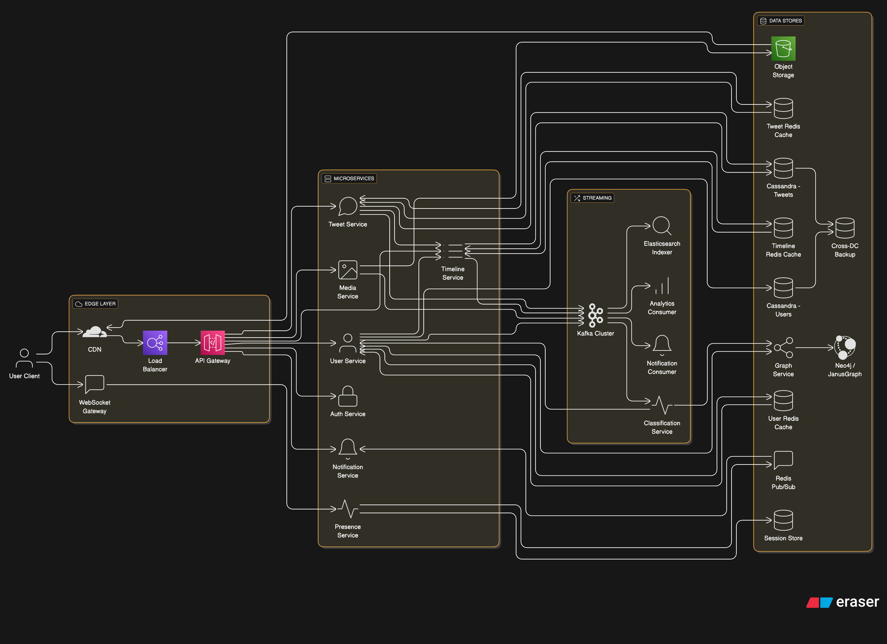

# Design Twitter – Social Media Platform

## 📋 Problem Statement

Design a large-scale social media platform like Twitter that allows users to:

- Post short messages (tweets) with optional media
- Follow/unfollow other users
- View a timeline of tweets from followed users
- Like, retweet, and reply to tweets
- Search tweets, users, hashtags, and trends
- Receive notifications for relevant activities
- Support trending topics and hashtags
- Ensure high availability, scalability, and security

## 🎯 Functional Requirements

### Core Features

1. **User Management**: Registration, authentication, profiles, follow/unfollow
2. **Tweet Management**: Post, delete, like, retweet, reply
3. **Timeline Generation**: Personalized timeline of tweets from followed users
4. **Search & Trends**: Search tweets, users, hashtags, trending topics
5. **Notifications**: Real-time and batch notifications for likes, retweets, replies, follows
6. **Media Support**: Attach images, videos, GIFs to tweets
7. **Direct Messaging**: (Optional) Private chat between users

### Non-Functional Requirements

- **Availability**: 99.9% uptime
- **Latency**: < 200ms for timeline load, < 1s for posting
- **Scalability**: 100M+ users, 1B+ tweets, global access
- **Consistency**: Eventual for timeline, strong for tweet/like/retweet
- **Security**: Data privacy, access control, abuse prevention

## 🏗️ System Architecture

### High-Level Architecture

```mermaid
graph TD
  Client[User Client]
  LB[Load Balancer]
  API[API Gateway]

  Client --> LB --> API
  API --> TweetService
  API --> UserService
  API --> TimelineService

  API[API Gateway]
  UserService[User Service]
  TweetService[Tweet Service]
  TimelineService[Timeline Service]
  MediaService[Media Service]
  NotificationService[Notification Service]
  AuthService[Auth Service]

  API --> UserService
  API --> TweetService
  API --> TimelineService
  API --> MediaService
  API --> NotificationService
  API --> AuthService

  TweetService --> TimelineService
  UserService --> TimelineService


  TweetService --> Kafka[Kafka Cluster]
  UserService --> Kafka
  TimelineService --> Kafka
  MediaService --> Kafka

  Kafka --> AnalyticsService[Analytics Consumer]
  Kafka --> SearchIndexer[Elasticsearch Indexer]
  Kafka --> NotificationConsumer

  TweetService --> Redis[Tweet Redis Cache]
  UserService --> RedisUser[User Redis Cache]
  TimelineService --> RedisTL[Timeline Redis Cache]

  RedisTL --> TimelineService
  RedisUser --> UserService
  Redis --> TweetService

  TweetService --> Kafka[Kafka Cluster]
  UserService --> Kafka
  TimelineService --> Kafka
  MediaService --> Kafka

  Kafka --> AnalyticsService[Analytics Consumer]
  Kafka --> SearchIndexer[Elasticsearch Indexer]
  Kafka --> NotificationConsumer

  TweetService --> Redis[Tweet Redis Cache]
  UserService --> RedisUser[User Redis Cache]
  TimelineService --> RedisTL[Timeline Redis Cache]

  RedisTL --> TimelineService
  RedisUser --> UserService
  Redis --> TweetService

  TweetService --> CassandraTweet[Cassandra - Tweets]
  UserService --> CassandraUser[Cassandra - Users]
  MediaService --> ObjectStorage[Object Storage]

  CassandraTweet --> BackupCluster[Cross-DC Backup]
  CassandraUser --> BackupCluster

  MediaService --> ObjectStorage
  ObjectStorage --> CDN[CDN Edge Layer]
  Client --> CDN

Client[User Client]
  Gateway[WebSocket Gateway]
  PresenceService[Presence Service]
  RedisPubSub[Redis Pub/Sub]
  SessionStore[Session Store (Redis/Memcached)]
  NotifService[Notification Service]
  
  Client --> Gateway
  Gateway --> PresenceService
  PresenceService --> SessionStore
  PresenceService --> RedisPubSub
  RedisPubSub --> NotifService

  UserService[User Service]
  GraphService[Graph DB Service]
  Neo4j[Graph DB (e.g., Neo4j / JanusGraph)]
  ClassificationService[User Classification Service]
  Kafka[Kafka Events]
  
  UserService --> GraphService
  GraphService --> Neo4j
  
  Kafka --> ClassificationService
  ClassificationService --> UserService
  
  ClassificationService --> GraphService  
```



### Core Components

---

#### 1. **API Gateway**
- Entry point for all client traffic (Web, Mobile)
- Responsibilities:
  - Authentication and routing
  - Rate limiting and request validation
  - Forwarding to internal services

---

#### 2. **Auth Service**
- Handles user login, logout, token refresh
- Supports OAuth2, JWT-based sessions
- Stores session metadata in Redis

---

#### 3. **User Service**
- Manages user profiles, preferences, and settings
- Interfaces with:
  - Graph Service for follow/unfollow relationships
  - Classification Service for dynamic user attributes
- Exposes user-related APIs to other services

---

#### 4. **Tweet Service**
- Responsible for:
  - Creating, updating, and deleting tweets
  - Attaching media (via Media Service)
  - Storing tweet content in Cassandra or ScyllaDB
- Publishes tweet-related events to Kafka

---

#### 5. **Timeline Service**
- Builds and serves user timelines
- Supports:
  - Fan-out on write (precomputed timeline)
  - Fan-out on read (on-the-fly aggregation)
- Pulls data from:
  - Tweet Service
  - Graph Service
  - Classification Service
- Caches hot timelines in Redis for fast access

---

#### 6. **Social Graph Service**
- Manages social relationships: follow, unfollow, mute, block
- Interfaces with Graph DB (Neo4j, JanusGraph, etc.)
- Supports:
  - Recommendations (who to follow)
  - Graph traversal for timeline and search

---

#### 7. **Classification Service**
- Analyzes user behavior and assigns dynamic types:
  - `Live`, `Active`, `Passive`, `Inactive`, `Famous`
- Consumes events from Kafka (likes, tweets, logins)
- Considers live sessions (via Redis/WebSocket)
- Outputs user types to:
  - Redis (fast access)
  - Cassandra (persistent storage)
  - Graph DB (influence/weight tagging)
- Consumed by Timeline, Feed, Notification, and Ad systems

---

#### 8. **Presence Service / WebSocket Gateway**
- Maintains live WebSocket connections
- Tracks user presence (online/offline/idle)
- Stores session data in Redis
- Publishes presence events to Kafka
- Used by:
  - Notification Service
  - Feed/Timeline Service
  - Classification Service

---

#### 9. **Like/Retweet Service**
- Tracks user interactions with tweets:
  - Likes, retweets, replies
- Enforces strong consistency
- Connects with:
  - Tweet Service (to update metadata)
  - Notification Service (to notify tweet owners)
  - Moderation System (to detect abuse or spam)

---

#### 10. **Search Service**
- Full-text search for tweets, users, and hashtags
- Built on Elasticsearch or OpenSearch
- Features:
  - Tokenization, relevance scoring, autocomplete
- Indexes updated via Kafka event streams

---

#### 11. **Trend Service**
- Computes trending topics, hashtags, and users
- Uses real-time data processing (e.g., Flink, Spark Streaming)
- Factors include:
  - Tweet frequency
  - Graph proximity
  - User classification (famous, active)
- Results cached and exposed to Search/Explore services

---

#### 12. **Notification Service**
- Sends real-time and batch notifications
- Supports:
  - In-app alerts
  - Push notifications (mobile)
  - Emails
- Triggered by Kafka events (likes, follows, mentions)
- Integrates with Presence Service for instant delivery

---

#### 13. **Media Service**
- Handles:
  - Upload and validation of images/videos
  - Processing (compression, thumbnail, transcoding)
  - Linking media to tweets
- Stores in:
  - Object storage (S3, GCS)
  - CDN for fast global delivery

---

#### 14. **Feed Service (Consumer)**
- Kafka consumer that processes new tweets and engagement events
- Updates:
  - Push timelines (precomputed)
  - Cache layers for hot users
- Prioritizes content based on:
  - Graph weight
  - Classification (famous, active users)
  - Content freshness

---

#### 15. **Storage Layer**
- **Cassandra / ScyllaDB**: Stores tweets, user metadata, likes, relationships
- **Redis**:
  - Caching (timelines, sessions, user types)
  - Fast lookups (presence, hot content)
- **Object Storage (S3, GCS, Azure Blob)**:
  - Stores media files, thumbnails, previews
- **CDN**:
  - Serves cached static assets globally with low latency

---

### Optional: Observability and Infra Layers (Not included above but recommended)
- **Monitoring**: Prometheus, Grafana
- **Tracing**: OpenTelemetry, Jaeger
- **Logging**: ELK stack or similar
- **API Analytics**: Rate limits, abuse tracking, usage patterns

## 💾 Data Models

### User Schema

```json
{
  "_id": "ObjectId",
  "username": "string",
  "email": "string",
  "password": "hashed",
  "profilePic": "url",
  "bio": "string",
  "followers": ["userId1", "userId2"],
  "following": ["userId1", "userId2"],
  "createdAt": "date"
}
```

### Tweet Schema

```json
{
  "_id": "ObjectId",
  "userId": "ObjectId",
  "text": "string",
  "mediaUrl": "string|null",
  "createdAt": "date",
  "likes": 123,
  "retweets": 45,
  "replies": 10,
  "hashtags": ["tag1", "tag2"],
  "mentions": ["userId1", "userId2"]
}
```

### Timeline Entry Schema

```json
{
  "_id": "ObjectId",
  "userId": "ObjectId",
  "tweetId": "ObjectId",
  "createdAt": "date"
}
```

### Like/Retweet Schema

```json
{
  "_id": "ObjectId",
  "tweetId": "ObjectId",
  "userId": "ObjectId",
  "type": "like|retweet|reply",
  "createdAt": "date"
}
```

## 🚀 Timeline Generation

### Strategies

- **Pull Model**: Generate timeline on read (query tweets from followed users)
- **Push Model**: Fan-out tweets to followers’ timelines on write
- **Hybrid**: Push for high-follower users, pull for others

### Caching

- Hot timelines cached in Redis
- Precompute timelines for active users
- Use background jobs for fan-out

### Pagination

- Use cursor-based pagination (createdAt, tweetId)
- Infinite scroll support

## 🔄 Tweet Posting & Delivery

### Posting Flow

1. Client posts tweet to Tweet Service
2. Tweet Service stores tweet, updates metadata
3. Timeline Service updates timelines (push/pull)
4. Notification Service notifies followers
5. Media Service processes and stores media (if any)

### Delivery

- Use CDN for fast, global delivery of media
- Lazy load images/videos in timeline

## 🔒 Security & Privacy

### Authentication & Authorization

- OAuth2, JWT for user auth
- Access control for private accounts, DMs
- Rate limiting, abuse prevention

### Data Protection

- Encryption at rest and in transit
- Secure media URLs (signed URLs, expiry)
- Moderation for tweets, replies

### Privacy

- User-controlled privacy settings
- Block/report users
- GDPR compliance

## 📊 Performance Optimization

### Tweets

- Use CDN for static content
- Compression and adaptive streaming for media
- Parallel uploads/downloads

### Timeline

- Precompute timelines for active users
- Use Redis for hot timeline caching
- Efficient fan-out with background workers

### Search

- Elasticsearch for indexing
- Autocomplete and trending queries

## 🛠️ Technology Stack

### Backend

- **Language**: Go, Java, or Node.js
- **Framework**: Spring Boot, Express.js, Gin
- **Storage**: AWS S3, GCS, Azure Blob
- **Metadata DB**: Cassandra, DynamoDB, MongoDB
- **Timeline Cache**: Redis
- **Search**: Elasticsearch
- **Queue**: Kafka, SQS

### Frontend

- **Web**: React, Angular, Vue.js
- **Mobile**: React Native, Flutter, native

### Infrastructure

- **Cloud**: AWS, GCP, Azure
- **Load Balancer**: AWS ALB, Nginx
- **CDN**: CloudFront, Cloud CDN
- **Monitoring**: Prometheus, Grafana
- **Logging**: ELK Stack

## 📈 Monitoring & Analytics

### Key Metrics

- **Timeline Latency**: Time to load timeline
- **Tweet Post Latency**: Time to post tweet
- **Engagement**: Likes, retweets, replies per user
- **Storage Utilization**: Per user, per region
- **Error Rates**: Failed tweets, timeline errors

### Alerting

- High error rates
- Timeline or tweet latency spikes
- Storage/CDN capacity thresholds
- Security/abuse incidents

## 🔄 Disaster Recovery

### Backup Strategy

- Regular metadata DB backups
- Cross-region replication for storage
- Automated restore procedures

### Failover Strategy

- Multi-region deployment
- Automatic failover for storage and DB
- Graceful degradation for non-critical features
- Data consistency checks after failover

---

## 📚 Additional Resources

- [Twitter Engineering Blog](https://blog.twitter.com/engineering/en_us)
- [How Twitter Scales](https://blog.twitter.com/engineering/en_us/topics/infrastructure/2017/the-infrastructure-behind-twitter-scale.html)
- [Twitter Timeline Architecture](https://blog.twitter.com/engineering/en_us/topics/infrastructure/2017/the-infrastructure-behind-twitter-scale.html)
- [CDN for Media Delivery](https://aws.amazon.com/cloudfront/)
- [Elasticsearch for Search](https://www.elastic.co/)

---
