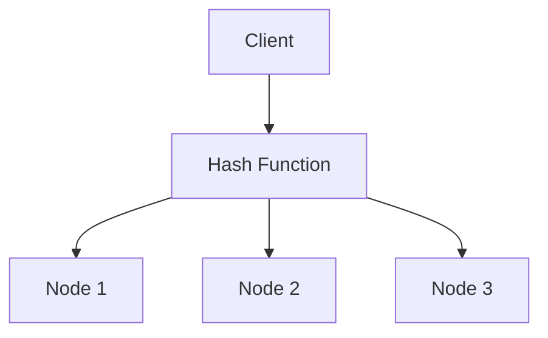

# 3. Advanced System Design Concepts

## Handling Large Scale Systems

### Distributed Systems

- Multiple servers/nodes work together to provide a single service.
- Challenges: network partitions, consistency, coordination.

### Scaling

- **Horizontal Scaling:** Add more servers (scale out).
- **Vertical Scaling:** Add more resources to a server (scale up).

### Distributed Transactions

- Ensuring data consistency across multiple services/databases.
- **Eventual Consistency:** Accept temporary inconsistency for better scalability.
- **Sagas:** Sequence of local transactions with compensating actions.

**Java Example (Distributed Transaction with Sagas - Pseudo):**

```java
// Service A
@Transactional
public void reserveInventory() {
    // Reserve item
    // Send event to Service B
}
// Service B listens for event and processes payment
```

---

## Event-Driven Architecture

### Event Sourcing

- Store state changes as a sequence of events.

### CQRS (Command Query Responsibility Segregation)

- Separate models for reading and writing data.

### Message Brokers

- Kafka, RabbitMQ, ActiveMQ for event streaming and decoupling.

### Pub/Sub Mechanism

- Publishers send events, subscribers receive them asynchronously.

**Java Example (Spring Boot + Kafka):**

```java
// Producer
kafkaTemplate.send("orders", orderEvent);
// Consumer
@KafkaListener(topics = "orders")
public void handleOrder(String event) {
    // Process event
}
```

---

## Designing for Low Latency

### Importance

- Low latency is critical for real-time apps (gaming, trading, chat).

### Techniques

- **Edge Computing:** Process data closer to users.
- **CDN:** Cache static content globally.
- **Real-Time Processing:** Use stream processing frameworks (e.g., Apache Flink).

**Java Example (WebSocket for Real-Time):**

```java
@ServerEndpoint("/chat")
public class ChatEndpoint {
    @OnMessage
    public String onMessage(String message) {
        return "Received: " + message;
    }
}
```

---

## Designing Distributed Systems

### Geographical Distribution

- Deploy services in multiple regions/data centers for resilience and low latency.

### Distributed Databases

- **Distributed SQL:** Google Spanner.
- **NoSQL:** Cassandra, DynamoDB.

### Consistent Hashing

- Evenly distribute data/requests across nodes.

**Mermaid Diagram: Consistent Hashing**



### Leader Election Algorithms

- Used for coordination (e.g., Paxos, Raft).

---

## APIs and Services

### RESTful API Design

- Resource-based, stateless, uses HTTP verbs.

**Java Example (Spring Boot REST):**

```java
@RestController
public class UserController {
    @GetMapping("/users/{id}")
    public User getUser(@PathVariable String id) {
        // Fetch user
    }
}
```

### GraphQL API Design

- Flexible queries, single endpoint.

**Java Example (GraphQL):**

```java
// Using graphql-java library
GraphQLSchema schema = ...;
GraphQL graphQL = GraphQL.newGraphQL(schema).build();
```

### API Rate Limiting

- Prevent abuse by limiting requests per user/IP.

**Java Example (Bucket4j):**

```java
Bucket bucket = Bucket4j.builder().addLimit(Bandwidth.simple(10, Duration.ofMinutes(1))).build();
```

### API Versioning

- Use /v1/, /v2/ in endpoints for backward compatibility.

---

## Designing for Security

### Secure Data Transmission

- Use TLS/SSL for encrypted communication.

### Common Attacks

- **SQL Injection:** Malicious SQL via input fields.
- **XSS:** Injecting scripts into web pages.
- **CSRF:** Unauthorized commands from a trusted user.

### Authentication Mechanisms

- **OAuth, OpenID Connect, JWT** for secure authentication.

### Encryption and Data Privacy

- Encrypt sensitive data at rest and in transit.

**Java Example (Encrypting Data):**

```java
Key key = ...;
Cipher cipher = Cipher.getInstance("AES");
cipher.init(Cipher.ENCRYPT_MODE, key);
byte[] encrypted = cipher.doFinal(data.getBytes());
```

---

**Summary:**

- Advanced HLD concepts help design robust, scalable, and secure systems.
- Java code samples show practical implementation of these advanced topics.
