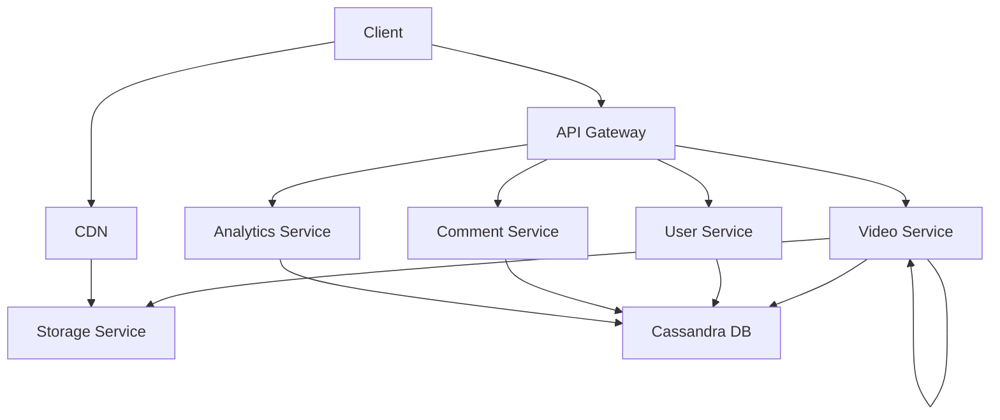
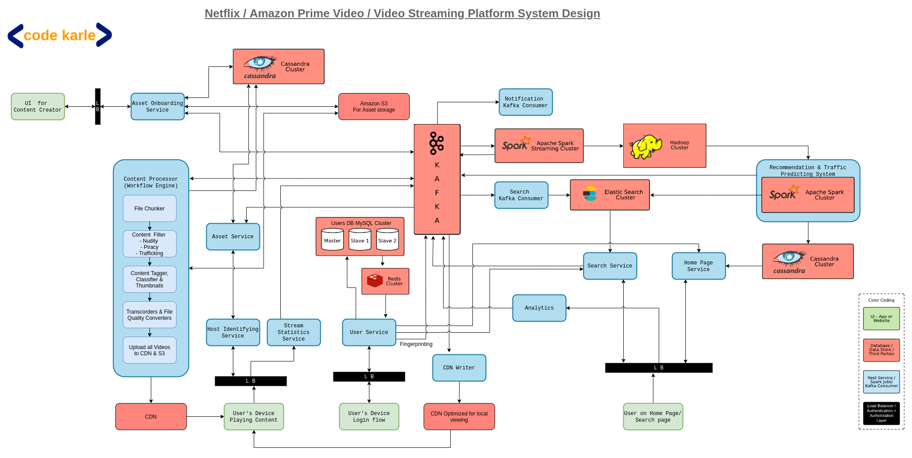

# Design YouTube – Video Hosting & Streaming

## 📋 Problem Statement

Design a video hosting, streaming, recommendation engine that can handle:
- Video upload, storage, and distribution
- User authentication and authorization
- Video playback, comments, and recommendations
- Search and filtering of videos
- Live streaming support
- Real-time analytics and insights

## 🎯 Functional Requirements

### Core Features
1. **Video Upload, Storage, and Distribution**: Users can upload, store, and distribute videos on the platform
2. **User Authentication and Authorization**: Users need to register and log in to access the platform 
3. **Video Playback, Comments, and Recommendations**: Users can watch videos, leave comments, and receive personalized recommendations
4. **Search and Filtering**: Users can search for videos based on keywords and filters
5. **Live Streaming Support**: Users can watch live streams of videos in real-time
6. **Real-time Analytics and Insights**: The platform provides real-time analytics and insights to help users make informed decisions 

### Non-Functional Requirements
- **Availability**: 99.99% uptime
- **Latency**: <= 200ms for real-time updates
- **Scalability**: Support large-scale user base and video distribution
- **Consistency**: Eventual consistency for real-time updates
- **Security**: Authenticated users only can access their own content

## 🏗️ System Architecture

### High-Level Architecture





### Core Components

#### 1. **[Component 1]**
- [Responsibility 1]
- [Responsibility 2]
- [Responsibility 3]

#### 2. **[Component 2]**
- [Responsibility 1]
- [Responsibility 2]
- [Responsibility 3]

#### 3. **[Component 3]**
- [Responsibility 1]
- [Responsibility 2]
- [Responsibility 3]

## 💾 Data Models

### [Entity 1] Schema
```javascript
{
  _id: ObjectId,
  // Add fields here
}
```

### [Entity 2] Schema
```javascript
{
  _id: ObjectId,
  // Add fields here
}
```

## 🔧 Key Implementation Details

### [Implementation Detail 1]
```javascript
// Add implementation code here
```

### [Implementation Detail 2]
```javascript
// Add implementation code here
```

## 🚀 Scalability Considerations

### Horizontal Scaling
- [Scaling strategy 1]
- [Scaling strategy 2]
- [Scaling strategy 3]

### Caching Strategy
- [Caching strategy 1]
- [Caching strategy 2]
- [Caching strategy 3]

### Database Design
- [Database strategy 1]
- [Database strategy 2]
- [Database strategy 3]

## 🔒 Security Considerations

### Authentication & Authorization
- [Security measure 1]
- [Security measure 2]
- [Security measure 3]

### Data Protection
- [Protection measure 1]
- [Protection measure 2]
- [Protection measure 3]

## 📊 Performance Optimization

### [Optimization Area 1]
- [Optimization 1]
- [Optimization 2]
- [Optimization 3]

### [Optimization Area 2]
- [Optimization 1]
- [Optimization 2]
- [Optimization 3]

## 🧪 Testing Strategy

### Unit Testing
- [Test type 1]
- [Test type 2]
- [Test type 3]

### Integration Testing
- [Test type 1]
- [Test type 2]
- [Test type 3]

### Load Testing
- [Test type 1]
- [Test type 2]
- [Test type 3]

## 🚀 Implementation Phases

### Phase 1: MVP ([Timeframe])
- [Feature 1]
- [Feature 2]
- [Feature 3]

### Phase 2: Enhanced Features ([Timeframe])
- [Feature 1]
- [Feature 2]
- [Feature 3]

### Phase 3: Advanced Features ([Timeframe])
- [Feature 1]
- [Feature 2]
- [Feature 3]

### Phase 4: Enterprise Features ([Timeframe])
- [Feature 1]
- [Feature 2]
- [Feature 3]

## 🛠️ Technology Stack

### Backend
- **Language**: [Language]
- **Framework**: [Framework]
- **Database**: [Database]
- **Cache**: [Cache]
- **Message Queue**: [Message Queue]

### Frontend
- **Framework**: [Framework]
- **State Management**: [State Management]
- **UI Library**: [UI Library]

### Infrastructure
- **Cloud**: [Cloud Provider]
- **Load Balancer**: [Load Balancer]
- **CDN**: [CDN]
- **Monitoring**: [Monitoring]
- **Logging**: [Logging]

## 📈 Monitoring & Analytics

### Key Metrics
- **[Metric 1]**: [Description]
- **[Metric 2]**: [Description]
- **[Metric 3]**: [Description]

### Business Metrics
- **[Metric 1]**: [Description]
- **[Metric 2]**: [Description]
- **[Metric 3]**: [Description]

## 🔄 Disaster Recovery

### Backup Strategy
- [Backup strategy 1]
- [Backup strategy 2]
- [Backup strategy 3]

### Failover Strategy
- [Failover strategy 1]
- [Failover strategy 2]
- [Failover strategy 3]

---

## 📚 Additional Resources

- [Resource 1](link)
- [Resource 2](link)
- [Resource 3](link)
- [Resource 4](link)

---

**Note**: This is a comprehensive system design for educational purposes. Real-world implementations may vary based on specific requirements, constraints, and business needs.
