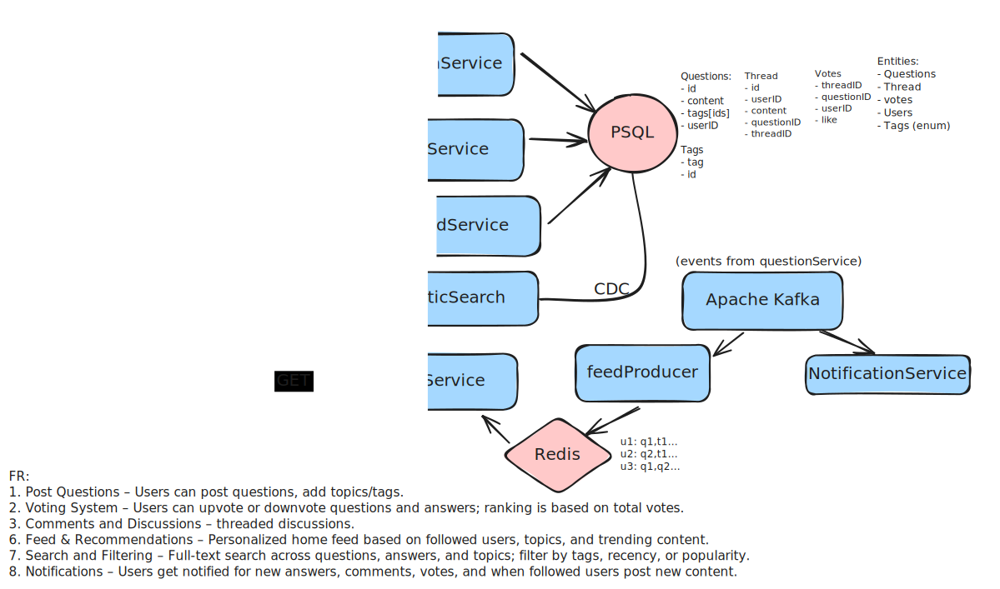

# 🧩 Design Quora / Reddit – Q&A Platform

## ✅ Core Features

### 🎯 Functional Requirements

1. **Post Questions** – Users can post questions, add topics/tags.
2. **Voting System** – Users can upvote or downvote questions and answers; ranking is based on total votes.
3. **Comments and Discussions** – threaded discussions.
4. **Feed & Recommendations** – Personalized home feed based on followed users, topics, and trending content.
5. **Search and Filtering** – Full-text search across questions, answers, and topics; filter by tags, recency, or popularity.
6. **Notifications** – Users get notified for new answers, comments, votes, and when followed users post new content.

---

## ⚙️ Non-Functional Requirements

| Category | Description |
|-----------|--------------|
| **Consistency** | Eventual consistency is acceptable for votes and reputation; strong consistency for user actions like posting or editing. |
| **Availability** | The platform should have high availability (≥99.9%) |
| **Latency** | Responses to user actions (like posting, voting, or searching) should be under 200–300 ms |
| **Scalability** | The system should scale horizontally to handle millions of users, posts, and concurrent requests. |

---

## 🏗️ System Architecture

### High-Level Architecture



### Core Components

1. **API Gateway / Load Balancer**
- Request routing, authentication (JWT verification), SSL termination, basic rate-limiting and request throttling.
- Route requests to appropriate microservices (questionService, voteService, threadService, feedService).
- Expose public APIs, enforce API keys / quotas, and assist with API versioning and observability metrics.

2. **questionService**
- CRUD for questions (create/edit/delete/get), validate request payloads and permissions.
- Persist question metadata to Postgres, emit domain events (Kafka) on create/update/delete for downstream consumers (feedProducer, notificationService, CDC).
- Enforce business rules (unique userID+threadID constraints, moderation flags, soft-deletes).

3. **voteService**
- Accept upvote/downvote requests, validate idempotency, and apply local rate-limits.
- Buffer votes (in-memory queue or Redis) and publish events to Kafka for batching and aggregation.
- Update aggregated vote counts (eventually via vote-aggregator worker) and trigger reputation change events.

4. **threadService / commentService**
- Manage threaded discussions and comments on questions/answers.
- Persist threads to Postgres and emit events to Kafka for feeds/notifications/search indexing.
- Enforce ordering, nesting limits, and moderation features (flags, deletes).

5. **feedProducer**
- Consume question/thread events from Kafka and update Redis feed caches (per-user timelines or global trending lists).
- Implement fanout strategies — fanout-on-write for passive users cached timelines, fanout-on-read for very high-fanout/popular items.
- Produce aggregates and ranking metadata (score, hotness) for feedService to use.

6. **feedService**
- Serve personalized feed to clients — read from Redis for fast responses, fallback to database or recompute if missing.
- Support pagination, infinite scroll, and ranking filters (recent, trending, recommended).
- Enforce read-side permissions (private posts, blocked users).

7. **notificationService**
- Consume events and user preference data, construct notification payloads (push) and send via FCM/APNs.
- Respect per-user notification preferences (mute tags, mute users, digest vs immediate).
- Batch/dedupe notifications when necessary and write notification history to Postgres for UI.

8. **Search (ElasticSearch)**
- Serve full-text search queries across questions, threads, and tags.
- Be populated via CDC (Debezium or DB-based publisher) from Postgres and accept updates from indexing consumers.
- Support filters, facets (tags), and relevance boosting (fresh content, votes).

9. **Postgres (Primary + replicas)**
- Source of truth for users, questions, threads, votes (aggregated), tags, and preferences.
- Strong consistency on critical transactions (post creation, edits, unique constraints).
- Expose logical replication / CDC stream for downstream systems (Debezium -> Kafka).

10. **Redis**
- Store per-user cached feeds (sorted sets / lists), hot counters (temporary vote buffers), locks, rate-limiter tokens.
- Provide fast lookups for recent/popular posts and reduce DB reads for the feed.
- TTL-based cache invalidation and ephemeral storage for queues and semaphores.

11. **Apache Kafka**
- Durable event bus for domain events (question created, vote received, thread reply).
- Enable decoupling between services, support replays for recovery (offsets), and retention for auditing.
- DLQ (dead-letter queue) for problematic messages and partitioning for scale.

## 💾 Data Models

### Questions Schema
```sql
CREATE TABLE questions (
  id BIGSERIAL PRIMARY KEY,
  user_id BIGINT NOT NULL,
  title TEXT NOT NULL,
  body TEXT,
  created_at TIMESTAMPTZ NOT NULL DEFAULT now(),
  updated_at TIMESTAMPTZ,
  is_deleted BOOLEAN DEFAULT false,
  draft BOOLEAN DEFAULT false,
  view_count BIGINT DEFAULT 0,
  vote_count INT DEFAULT 0,
  comment_count INT DEFAULT 0,
  tags TEXT[], -- or normalized via question_tags
  thread_id BIGINT, -- if tied to a thread entity
  CONSTRAINT fk_user FOREIGN KEY(user_id) REFERENCES users(id)
);

CREATE INDEX idx_questions_created_at ON questions (created_at DESC);
CREATE INDEX idx_questions_vote_count_created_at ON questions (vote_count DESC, created_at DESC);
-- GIN index for tags if stored as array:
CREATE INDEX idx_questions_tags_gin ON questions USING GIN (tags);

```

### Threads / Comments Schema
```sql
CREATE TABLE threads (
  id BIGSERIAL PRIMARY KEY,
  question_id BIGINT NOT NULL,
  user_id BIGINT NOT NULL,
  parent_id BIGINT, -- NULL for root comment
  content TEXT NOT NULL,
  created_at TIMESTAMPTZ DEFAULT now(),
  updated_at TIMESTAMPTZ,
  is_deleted BOOLEAN DEFAULT false,
  CONSTRAINT fk_question FOREIGN KEY (question_id) REFERENCES questions(id),
  CONSTRAINT fk_user FOREIGN KEY (user_id) REFERENCES users(id)
);

CREATE INDEX idx_threads_question_created ON threads (question_id, created_at DESC);
```

### Votes Schema
```sql
-- append / raw votes (optional if you want every vote recorded)
CREATE TABLE votes_raw (
  id BIGSERIAL PRIMARY KEY,
  user_id BIGINT NOT NULL,
  question_id BIGINT,
  thread_id BIGINT,
  vote SMALLINT NOT NULL, -- 1 or -1
  created_at TIMESTAMPTZ DEFAULT now(),
  CONSTRAINT fk_user FOREIGN KEY (user_id) REFERENCES users(id)
);

-- aggregate table for quick reads
CREATE TABLE votes_agg (
  item_type TEXT NOT NULL, -- 'question' | 'thread'
  item_id BIGINT NOT NULL,
  upvotes BIGINT DEFAULT 0,
  downvotes BIGINT DEFAULT 0,
  score BIGINT GENERATED ALWAYS AS (upvotes - downvotes) STORED,
  PRIMARY KEY (item_type, item_id)
);
```

### Votes Schema
```sql
CREATE TABLE tags (
  id BIGSERIAL PRIMARY KEY,
  tag TEXT UNIQUE NOT NULL,
  meta JSONB, -- synonyms, description
  created_at TIMESTAMPTZ DEFAULT now()
);
```

## 🚀 Scalability Considerations

### Horizontal Scaling
- Use stateless service instances behind API Gateway with autoscaling groups (scale with CPU/RPS).
- Partition Kafka topics (topic per domain or use logical partitioning) and ensure replication factor ≥ 3 across brokers.
- Scale Postgres reads with read replicas and move read-heavy features (feeds/search) to read replicas or cache layers.
- Use sharding/partitioning for huge tables (questions, votes_agg) by hash on id or by time ranges for archival.

### Caching Strategy
- Per-user feeds in Redis (ZSET) for low-latency reads; TTLs to evict stale feeds.
- CDN (S3 + CloudFront) for static assets (images, avatars).
- Query result caches for expensive search facets; cache at API layer with versioning keys for invalidation.
- Local in-process caches (LRU) for small frequently used metadata (tag list, user profile previews).

### Database Design
- Normalize core entities but consider denormalization for reads (e.g., store tag array on questions for fast filter).
- Use partitioning (range or hash) on large tables (votes_raw, questions) and create maintenance jobs for archiving.
- Index strategy: compound indexes on (user_id, created_at), GIN on tags, btree on vote_count for sorting.
- Use connection pooling (PgBouncer), tuned pool sizes and statement timeouts.

---