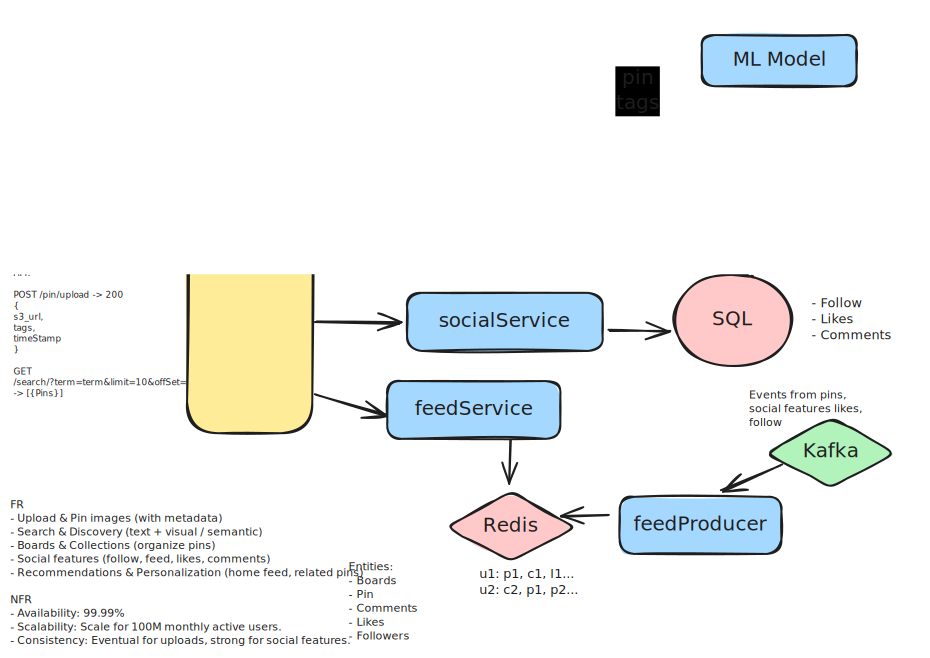

# Design Pinterest – Image Discovery Platform

## Core Features

### 🎯 Functional Requirements
- Upload & Pin images (with metadata)
- Search & Discovery (text + visual / semantic)
- Boards & Collections (organize pins)
- Social features (follow, feed, likes, comments)
- Recommendations & Personalization (home feed, related pins)

### Non-Functional Requirements
- **Availability**: 99.99%
- **Scalability**: Daily 10M+ pins, 100M+ users (Read:Write = 10:1)
- **Consistency**: Eventual for uploads, strong for social features

## 🏗️ System Architecture

### High-Level Architecture



### Core Components

#### 1. **Pin Service**
- Manages creation and storage of pins and boards (metadata + S3 URLs).
- Triggers asynchronous ML inference jobs after successful upload (via Kafka).
- Updates Cassandra (Pin metadata) and publishes CDC events for ElasticSearch indexing.

#### 2. **Machine Learning Service**
- Consumes messages (pin-created events) from Kafka and fetches image from S3.
- Runs image classification model (CNN/CLIP) to extract tags or embeddings.
- Updates tags in Cassandra and sends new tag data to Elasticsearch for search indexing.

#### 3. **Social Service**
- Manages user relationships — follows, likes, comments.
- Stores relational data in SQL (e.g., PostgreSQL) for consistency and easy joins.
- Publishes activity events (like/follow/comment) to Kafka for feed generation.

#### 3. **Feed Service**
- Subscribes to Kafka topics (pin_created, like_event, follow_event) to build user feeds.
- Uses a hybrid approach:
  - Fan-out on write for popular users.
  - Fan-out on read for normal users.
- Stores computed feeds in Redis (sorted by timestamp for fast retrieval).

## 💾 Data Models

### Pin Schema
```javascript
{
  pin_id: UUID,
  user_id: UUID,
  board_id: UUID,
  s3_url: "https://s3.amazonaws.com/pins/123.jpg",
  tags: ["rose", "flower", "nature"],
  created_at: timestamp,
  updated_at: timestamp
}
```

### Board Schema
```javascript
{
  board_id: UUID,
  user_id: UUID,
  title: "My Garden Collection",
  description: "All beautiful flowers I found",
  pin_ids: [UUID],
  created_at: timestamp
}
```

### Social Schema
```sql
TABLE follows (
  follower_id UUID,
  followee_id UUID,
  created_at TIMESTAMP
);

TABLE likes (
  user_id UUID,
  pin_id UUID,
  created_at TIMESTAMP
);

TABLE comments (
  comment_id UUID PRIMARY KEY,
  user_id UUID,
  pin_id UUID,
  text TEXT,
  created_at TIMESTAMP
);
```

## 🚀 Scalability Considerations

### Horizontal Scaling
- Deploy all stateless services (gateway, pinService, ML inference, search, feed) behind load balancers.
- Scale Cassandra horizontally by adding nodes to increase partition capacity.
- ElasticSearch clusters scaled by adding shards and replica nodes.
- Kafka partitioning used for throughput and ordered processing.

### Caching Strategy
- Redis Feed Cache: Store user timelines with TTL (e.g., 24h).
- CDN Edge Caching: Serve images from edge nodes globally to reduce latency.
- Search Query Cache: Cache popular tag searches in Redis to reduce ES load.

### Database Design
- Cassandra: Data modeled around access patterns (user_id, board_id → list of pins).
- SQL: Indexed foreign keys (pin_id, user_id) for fast joins on likes/follows.
- ElasticSearch: Indexed by tags, title, and optionally vector for visual search.
- CDC Pipeline (Debezium): Cassandra → Kafka → Indexer → ElasticSearch for near-real-time sync.

---
