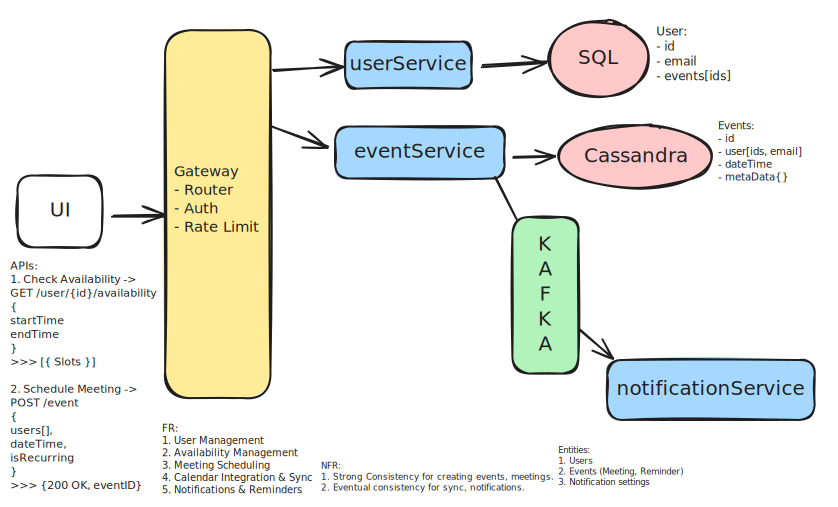

# Design Calendly / Google Calendar – Scheduling System

## 📋 Problem Statement

Design a scheduling system that allows users to manage their availability, schedule meetings, send notifications, and integrate with other calendars. The system should support high concurrency, real-time updates, and scalable event storage.

## Core Features

### 🎯 Functional Requirements

1. **User Management**: Users can create accounts, login/logout, and manage profiles.
2. **Availability Management**: Users can see available time slots for meetings. Supports recurring availability rules.
3. **Meeting Scheduling**: Users and external participants can book meetings based on availability. Prevent double-booking by checking overlapping events.
4. **Calendar Integration & Sync**: Integrate with Google Calendar, Outlook, iCal, etc.
5. **Notifications & Reminders**: Send email, push, or SMS reminders before meetings. Allow customizable reminder timings (e.g., 10 min, 1 hour).

### 🎯 Non-Functional Requirements

- **Consistency**: Strong consistency for scheduling, eventual for notifications
- **Scalability**: Handle large volumes of events and users (10M users, 1M events per day)
- **Availability**: 99.99% uptime
- **QPS**: 5000 QPS for scheduling, 1000 QPS for notifications

## 🧾 APIs (example)

- `POST /users` — create user
- `GET /user/{id}/availability?start=&end=` — check availability (backend usage)
- `POST /events` — create event (body: participants, start, end, recurrenceRule, idempotencyKey)
- `PUT /events/{id}` — update event
- `DELETE /events/{id}` — cancel event
- `POST /webhook/google` — endpoint for Google push notifications (SyncService)

## 🏗️ System Architecture

### High-Level Architecture



### Core Components

#### 1. **User Service**

- Manage user accounts, email, timezone, connected calendar metadata
- Strong-consistency store (Postgres) for identity and critical metadata
- Provide endpoints for user profile & linked-calendars info

#### 2. **Event Service**

- Persist event metadata, recurrence rules, attendees in Cassandra
- Ensure correctness when booking (check availability, use idempotency key)
- Write events atomically then emit event to Kafka (outbox / saga-like pattern)
- Provide APIs for create/update/cancel events

#### 3. **Scheduler Service**

- Calculate next occurrence for recurring events
- Query Cassandra for events due in the near window (e.g., next 5 minutes)
- Produce reminder messages to Kafka notification topic
- Maintain progress checkpointing to resume after restarts

#### 4. **Notification Service**

- Consume notification topic and send via Email/SMS/Push
- Support webhook-based delivery (for external endpoints)
- Retry with exponential backoff and push failures to Kafka DLQ
- Ensure idempotent delivery via idempotency keys

#### 6. **Webhook / Sync Service**

- Receive external calendar webhooks (Google/Outlook)
- Normalize and apply changes to EventService (with mapping table)
- Emit outgoing webhooks when local events change
- Maintain webhook session & verification (retries, backoff, auth)

## 💾 Data Models

```javascript
users (
  id UUID PRIMARY KEY,
  email VARCHAR UNIQUE,
  name VARCHAR,
  timezone VARCHAR,
  events JSONB,
  connected_calendars JSONB, e.g. [{provider:"google", _id:"..."}]
  created_at TIMESTAMP,
  updated_at TIMESTAMP
)

events (
  {
  id: UUID,
  organizerId: UUID,
  participantIds: [UUID],
  // timestamp for an instance
  startTime: ISODate,
  endTime: ISODate,
  isRecurring: boolean,
  // store RRULE or similar
  recurrenceRule: "RRULE:FREQ=MONTHLY;BYMONTHDAY=1",
  // optional helper field
  nextOccurrence: ISODate,
  metadata: {
    title: "Team Sync",
    location: "Zoom",
    description: "Monthly sync"
  },
  // for synced external events
  externalMappings: {
    google: "googleEventId123",
    outlook: "outlookId456"
  }
}
)

notification (
    {
    "notificationId": "uuid",
    "eventId": "uuid",
    "userId": "uuid",
    "deliverAt": "2025-10-20T12:00:00Z",
    "channel": "email|sms|push|webhook",
    "payload": { /* channel payload */ },
    "idempotencyKey": "eventId:reminderType"
  }
)
```

## 🔁 Key Flows

### Booking an Event (create)

- Client calls `POST /events` to EventService with idempotency key.
- EventService:
  - Checks availability (`Availability API`) by querying events overlap in Cassandra (and cached Redis).
  - Persists event record in Cassandra.
  - Writes an outbox record / publishes `event.created` to Kafka (ensure atomic visibility or use CDC/outbox pattern).
- Scheduler/Notification consumes event.created → schedules reminders.

### Recurring Event Handling

- Store recurrenceRule (RRULE). Do not materialize all future occurrences.
- Scheduler computes next occurrence, enqueues a reminder message for that time.
- After firing, it computes and enqueues the next one.

### Notifications

- Scheduler publishes to Kafka notification topic with `deliverAt`.
- Notification workers consume and deliver.
- On failure, worker retries; after max attempts, push to DLQ topic for manual processing.

### Webhook Sync

- WebhookService listens to external calendar webhooks and maps events.
- On local changes: WebhookService sends outgoing webhooks to configured external targets.
- Use externalMappings to avoid duplicate creation.

## 📊 Performance Optimization

### Key Considerations

- For conflict-sensitive operations (booking), consider a short-lived locking mechanism or a strongly-consistent coordination (Postgres row lock or a coordinator service).
- For notification delivery, use Kafka's built-in message deduplication and idempotency features.

---

## 📚 Additional Resources

- [System Design School](https://systemdesignschool.io/problems/google-calendar/solution)

---
