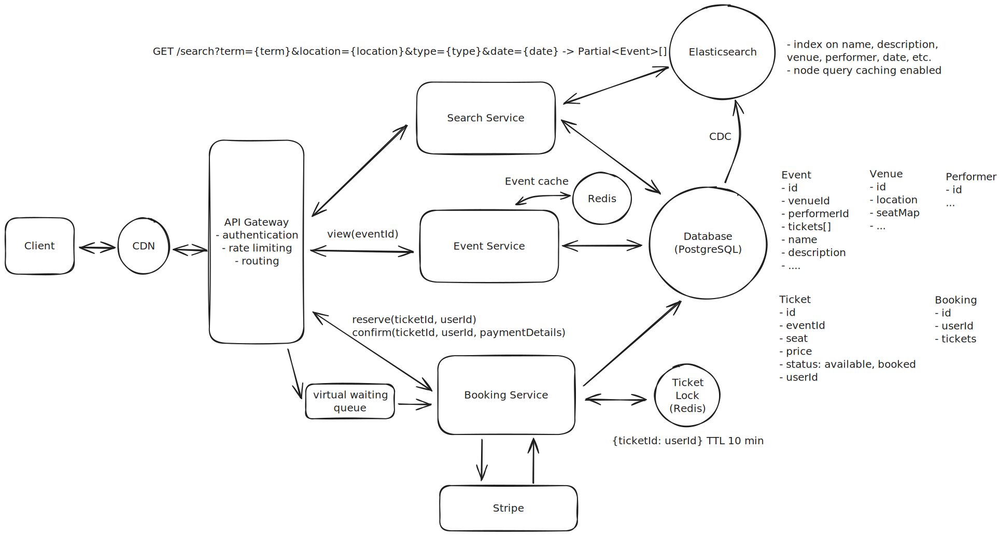

# Design Ticketmaster / BookMyShow – Ticket Booking

## 📋 Problem Statement

Design a ticket booking with seat selection and payment that can handle:

### 🎯 Functional Requirements

1. **View Events**: Users should be able to view events.
2. **Search Events**: Users should be able to search for events.
3. **Book Tickets**: Users should be able to book tickets to events.

### 🎯 Non-Functional Requirements

- The system should prioritize availability for searching & viewing events, but should prioritize consistency for booking events (no double booking)
- The system should be scalable and able to handle high throughput in the form of popular events (10 million users, one event)
- The system should have low latency search (< 500ms)
- The system is read heavy, and thus needs to be able to support high read throughput (100:1)

## 🏗️ System Architecture

### High-Level Architecture



### Entities

- Event
- User
- Performer
- Venue
- Ticket
- Booking

### API or System Interface

1. **View Events**:

```javascript
GET /events/:eventId
-> Event & Venue & Performer & Ticket[]
```

2. **Search Events**:

```javascript
GET /events/search?keyword={keyword}&start={start_date}&end={end_date}&pageSize={page_size}&page={page_number}
-> Event[]
```

3. **Book Tickets**:

```javascript
POST /bookings/:eventId
{
  "ticketIds": string[],
  "paymentDetails": ...
}
-> bookingId
```

---

### Core Components

#### 1. **Event Service**

- Wiew API requests by fetching the necessary event, venue, and performer information from the database.
- Events DB stores tables for events, performers, and venues.

#### 2. **Search Service**

- Elasticsearch or a similar full-text search engine.
- To make sure the data in Elasticsearch is always in sync with the data in our SQL DB, we can use change data capture (CDC) for real-time or near-real-time data synchronization from PostgreSQL to Elasticsearch.
- We can enable fuzzy search functionality with Elasticsearch.

#### 3. **Booking Service**

- Interfaces with the Payment Processor (Stripe) for transactions. Once payment is confirmed, the booking service updates the ticket status to "SOLD".
- CRUD on Bookings and Tickets.

## 💾 Data Models

### Event Schema

```sql
{
  _id: ObjectId,
  name: string,
  description: string,
  date: Date,
  performers: [ObjectId],
  venue: ObjectId,
  tickets: [ObjectId]
}
```

### Venue Schema

```sql
{
  _id: ObjectId,
  location: string,
  seatMap: []
}
```

### Ticket Schema

```sql
{
  _id: ObjectId,
  eventID: ObjectId,
  seat: string,
  price: number,
  status: "AVAILABLE" | "SOLD"
  userID: ObjectId
}
```

### Performer Schema

```sql
{
  _id: ObjectId,
  name: string,
  description: string,
  image: string
}
```

## 📊 Performance Optimization

### Booking Service Optimizations

- Use a distributed lock with a TTL using a distributed system like Redis.
- Lock ticket in Redis with ticket ID when user selects it (key = ticket ID, value = user ID).
- Use TTL to auto-expire lock if purchase isn’t completed.
- On successful purchase, update DB to "SOLD" and release Redis lock.
- If TTL expires, Redis auto-releases lock; ticket becomes available again.
- Ticket table has only two states: "AVAILABLE" and "SOLD".

### Ensuring ticketing scalability

- Virtual waiting queue for popular events.
- Users are placed in this queue before even being able to see the booking page (seat map selected).
- User added to virtual queue & WebSocket connection established.
- Queue uses WebSocket ID.

## 📚 Additional Resources

- [Problem Breakdown](https://www.hellointerview.com/learn/system-design/problem-breakdowns/ticketmaster)
- [Youtube](https://www.youtube.com/watch?v=fhdPyoO6aXI&t=3379s)

---
