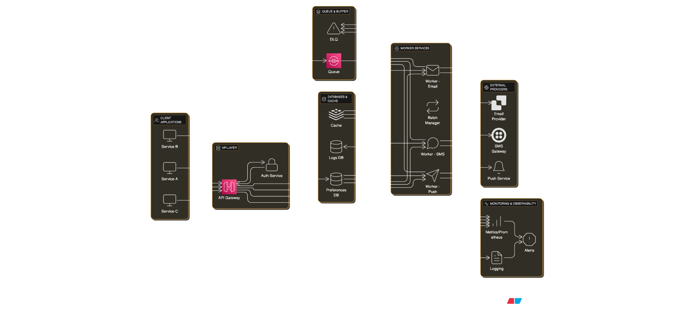

# Design Notification System – Multi-channel Messaging

## 📋 Problem Statement

Design a robust notification system (push / email / SMS) that supports retries, batching, scheduling, priorities, templating, and observability.  
The system must handle high throughput (millions of notifications/day), provide delivery guarantees (at-least-once with idempotency), support multiple providers per channel, respect user preferences and throttling, and expose operational metrics and audit trails.

---

## 🎯 Functional Requirements

### Core Features

1. **Send multi-channel notifications** — support push (FCM/APNs), email (SMTP / ESPs), and SMS (telecom providers / SMS gateways).
2. **Retries & backoff** — automatic retry with exponential backoff, jitter, and dead-letter handling for failed deliveries.
3. **Batching** — group notifications where possible to reduce cost and provider rate usage.
4. **Scheduling & recurring** — schedule notifications for future delivery and support recurring rules (cron-like).
5. **User preferences & rate-limits** — per-user/channel preferences (opt-in, do-not-disturb windows, priority) and global/provider rate-limiting.

### Non-Functional Requirements

- **Availability**: 99.95% or better for core API and dispatching.
- **Latency**: <200ms for enqueueing API requests.
- **Scalability**: Horizontally scalable workers, partitioned queues, autoscaling.
- **Consistency**: Eventual consistency for delivery state, strong idempotency for enqueue.
- **Security**: TLS in transit, secrets stored in vault, RBAC for admin APIs, audit trails.

### Entities

- **Notification**: Enqueued, scheduled, dispatched, delivered, or failed.
- **Channel**: Push, email, SMS.
- **Provider**: FCM, ESP, SMS gateway.
- **Template**: Versioned, multi-language templates.
- **User**: Opt-in, DND windows, throttling rules.

### API Endpoints

#### 1. Create Notification - Enqueue a new notification (email, SMS, or push).

```json
POST /api/v1/notifications
Body : {
  "channel": "EMAIL",
  "recipient": "user@example.com",
  "message": "Welcome to our platform!",
  "metadata": {
    "priority": "HIGH"
  }
}

Response : {
  "notificationId": "12345-abc",
  "status": "QUEUED"
}
```

2. Get Notification Status - Fetch the current status of a notification (QUEUED, SENT, DELIVERED, FAILED).

```json
GET /api/v1/notifications/{notificationId}
Response : {
  "status": "DELIVERED"
}
```

3. Bulk Create Notifications - Submit multiple notifications at once (batching support).

```json
Body : {
  "notifications": [
    {
      "channel": "SMS",
      "recipient": "+1555123456",
      "message": "Your OTP is 987654"
    },
    {
      "channel": "EMAIL",
      "recipient": "user@example.com",
      "message": "Your invoice is ready."
    }
  ]
}

Response : {
  "batchId": "batch-6789",
  "notifications": [
    { "notificationId": "n1", "status": "QUEUED" },
    { "notificationId": "n2", "status": "QUEUED" }
  ]
}
```

4. Retry Notification (Manual Trigger) - Force a retry for a failed notification (usually automatic, but can be manually triggered).

```json
POST /api/v1/notifications/{notificationId}/retry

Response : {
  "notificationId": "12345-abc",
  "status": "RETRY_QUEUED"
}
```

---

## 🏗️ System Architecture

### High-Level Architecture

## 

## 💡 Core Components

### 1. API Gateway / Ingest

- Validate, authenticate, and authorize incoming requests.
- Enforce quotas and rate limits.
- Persist notifications and publish to message bus.
- Return acknowledgement with `notification_id`.

### 2. Message Bus / Queue

- Durable, partitioned log (Kafka/Pulsar).
- Ensures reliability and horizontal scalability.

### 3. Batcher

- Groups notifications within small windows for bulk dispatch.
- Reduces provider costs and API calls.

### 4. Dispatcher (Workers)

- Pulls from message bus.
- Transforms into provider-specific formats.
- Calls channel adapters and tracks delivery.

### 5. Retry & Dead-Letter Handler

- Retries failed deliveries with exponential backoff + jitter.
- Moves persistent failures to DLQ.

### 6. Template Service

- Stores and renders templates.
- Supports versioning and multi-language templates.

### 7. User Preferences & RateLimiter

- Enforces opt-in/opt-out, DND, and throttling rules.

### 8. Monitoring & Observability

- Metrics: delivery success rate, queue lag, retries.
- Tracing: notification lifecycle.
- Alerts: DLQ growth, error spikes.

---

## 💾 Data Models

### Notification Schema

```javascript
{
  _id: ObjectId,
  notification_id: String,
  tenant_id: String,
  template_id: String,
  channel: "email" | "sms" | "push",
  priority: "high" | "normal" | "low",
  payload: {
    subject?: String,
    body?: String,
    variables?: Object
  },
  recipients: [
    { user_id?: String, address: String }
  ],
  status: "queued" | "dispatched" | "delivered" | "failed" | "scheduled",
  scheduled_at?: ISODate,
  created_at: ISODate,
  updated_at: ISODate,
  attempts: Number
}
```

### DeliveryAttempt Schema

```javascript
{
  _id: ObjectId,
  notification_id: String,
  recipient_address: String,
  provider: String,
  attempt_number: Number,
  status: "success" | "retryable_failure" | "permanent_failure",
  response_code: Number,
  response_body: String,
  tried_at: ISODate,
  next_retry_at?: ISODate
}
```

### Template Schema

```javascript
{
  _id: ObjectId,
  template_id: String,
  tenant_id: String,
  name: String,
  channel: "email" | "sms" | "push",
  language: String,
  subject: String,
  body: String,
  variables: [String],
  version: Number,
  active: Boolean
}
```

### ProviderConfig Schema

```javascript
{
  _id: ObjectId,
  provider_id: String,
  channel: "email"|"sms"|"push",
  credentials_ref: String,
  region: String,
  priority: Number,
  rate_limit: { calls_per_second: Number, burst: Number }
}
```

---

## 🔧 Key Implementation Details

### Idempotency & Deduplication

```java
@Service
public class NotificationService {

    @Autowired
    private NotificationRepository notificationRepository;

    @Autowired
    private MessagePublisher messagePublisher; // Kafka/RabbitMQ abstraction

    public NotificationResponse enqueueNotification(NotificationRequest request) {
        String notificationId = request.getNotificationId() != null ?
                                request.getNotificationId() : UUID.randomUUID().toString();

        Optional<NotificationEntity> existing = notificationRepository.findByNotificationId(notificationId);
        if (existing.isPresent()) {
            return new NotificationResponse(notificationId, existing.get().getStatus());
        }

        NotificationEntity entity = new NotificationEntity();
        entity.setNotificationId(notificationId);
        entity.setStatus("QUEUED");
        entity.setCreatedAt(LocalDateTime.now());
        entity.setPayload(request.getPayload());
        notificationRepository.save(entity);

        messagePublisher.publish("notifications", notificationId, entity);

        return new NotificationResponse(notificationId, "QUEUED");
    }
}
```

### Retry Worker

```java
public class RetryPolicy {

    private static final long BASE_MS = 1000;
    private static final long MAX_MS = 24 * 60 * 60 * 1000; // 24 hours

    public static long computeBackoff(int attempt) {
        long backoff = (long) Math.min(MAX_MS, BASE_MS * Math.pow(2, attempt));
        long jitter = (long) (Math.random() * 0.1 * backoff);
        return backoff + jitter;
    }
}

@Service
public class RetryWorker {

    @Autowired
    private ChannelAdapter adapter;

    public void process(NotificationEntity notification, int attempt) {
        try {
            adapter.send(Collections.singletonList(notification));
            notification.setStatus("DELIVERED");
        } catch (Exception e) {
            long delay = RetryPolicy.computeBackoff(attempt);
            // reschedule job with delay (via Kafka Delay Queue / Quartz / Spring Scheduler)
            notification.setStatus("RETRY_PENDING");
        }
    }
}

```

### Adapter Interface

```java
public interface ChannelAdapter {
    void send(List<NotificationEntity> batch) throws Exception;
    boolean healthCheck();
}

@Service("emailAdapter")
public class EmailAdapter implements ChannelAdapter {
    @Override
    public void send(List<NotificationEntity> batch) {
        // integrate with SES / SendGrid API
    }

    @Override
    public boolean healthCheck() {
        // call provider health API
        return true;
    }
}

@Service("smsAdapter")
public class SmsAdapter implements ChannelAdapter {
    @Override
    public void send(List<NotificationEntity> batch) {
        // integrate with Twilio API
    }

    @Override
    public boolean healthCheck() {
        return true;
    }
}

@Service("pushAdapter")
public class PushAdapter implements ChannelAdapter {
    @Override
    public void send(List<NotificationEntity> batch) {
        // integrate with Firebase Cloud Messaging (FCM) or APNs
    }

    @Override
    public boolean healthCheck() {
        return true;
    }
}

```

---

## 🚀 Scalability Considerations

### Horizontal Scaling

- Partitioned message bus for parallelism.
- Stateless workers behind load balancer.
- Sharded databases for tenants.

### Caching Strategy

- Templates & provider configs cached in Redis.
- User preferences cached with TTL.
- Idempotency keys cached for dedupe.

### Database Design

- Relational or document DB for notifications.
- Append-only event store for audit logs.
- Analytics DB for metrics.

---

## 📊 Performance Optimization

### Provider Bulk & Parallelism

- Use bulk APIs (SendGrid, Twilio).
- Reuse HTTP/2 or persistent TCP connections.

### Backpressure & Rate-Limiting

- Token bucket rate limiters.
- Backpressure applied when overloaded.

### Retry & DLQ Management

- Exponential backoff with jitter.
- DLQ monitoring and alerting.

### Storage & Indexing

- Index notification_id, status, scheduled_at.
- TTL for old records to control growth.

## 📚 Additional Resources

- [Youtube - HLD](https://youtu.be/CUwt9_l0DOg?si=-R3V18_BGrTU2EXs)
- [Youtube - LLD](https://youtu.be/t-4r2AsJz_Q?si=tK5WKSQSBaRQMHHF)

---
