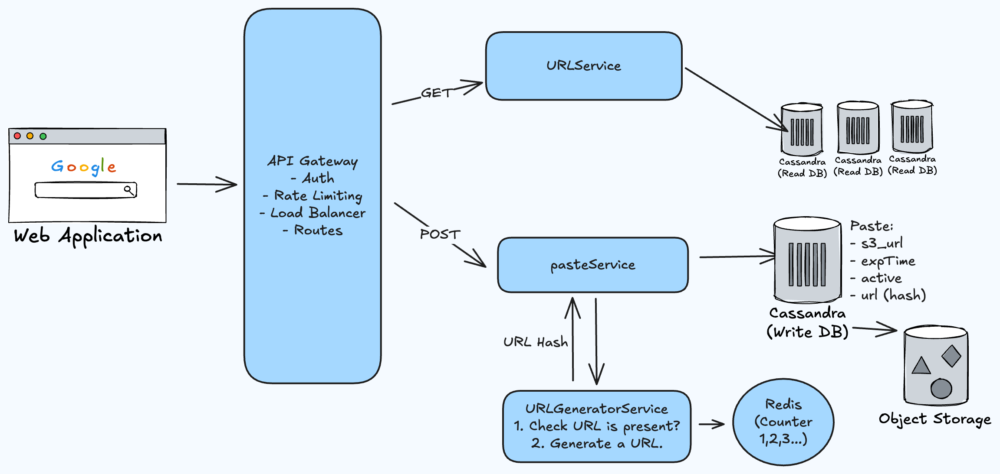

# Design Pastebin / Gist – Text Storage Service

## 📋 Problem Statement

Design a text storage with public/private links and expiration that can handle:

## 🎯 Functional Requirements

### Core Features
1. **Create a Paste**: Create a new paste with text content and an optional expiration time.
2. **Retrieve a Paste**: Retrieve the content of a specific paste by its unique URL.

- Create a Paste with custom expiration time
- Generate unique URL for each paste
- Retrieve paste by unique URL

### Non-Functional Requirements
- Availability >> Consistency for creating/retrieving paste.
- Consistency >> Availability for creating URL.
- Latencty (< 100ms)
- Rate Limiting

### Constraints

- 100M daily active users
- 10:1 read/write ratio
- 100M paste per day
- 100 * 10^6 / 10^5 = 1000 paste/second

---

## 🏗️ System Architecture

### High-Level Architecture



### Core Components

#### 1. **API Gateway**
- Entry point for all client traffic (Web, Mobile)
- Handles authentication, authorization, rate limiting
- Routing to backend microservices

#### 2. **Paste Service**
- Handles paste creation 
- Storing the text file
- Generating unique URL for each paste

#### 3. **URL Service**
- Handles URL retrieval from read replicas

#### 3. **URLGenerator Service**
- Checks if URL is available and generates unique URL for each paste
- Gets the Count from Redis and return the hash value to generate unique URL

---

### APIs

#### 1. **Create Paste**
- POST /paste
- Body: { text: String, expiration: Date }
- Returns: { url: String }

#### 2. **Retrieve Paste**
- GET /paste/:url
- Returns: { text: String }

---

## 💾 Data Models

### Paste Schema
```sql
{
  _id: ObjectId,
  s3_url: String,
  expiration: Date,
  active: Boolean
  url_hash: String
  user_id: ObjectId
}
```

### User Schema
```sql
{
  _id: ObjectId,
  name: String,
  email: String
}
```

---

## 🚀 Scalability Considerations

### Horizontal Scaling
- Since all the services are stateless, horizontal scaling is possible by adding more instances of each service and load balancing the traffic across them.
- For the URL generator service, we can use Redis to store the count of generated URLs and generate unique URLs based on the count.

### Caching Strategy
- Redis can be used as a cache layer to improve the performance of the URL generation service.
- Redis can also be used to store the count of generated URLs to ensure that they are unique.

### Database Design
- For Paste related data, we can use NoSQL database like Cascandra or DynamoDB.
- For User related data, we can use SQL database like MySQL or Postgres.
- For Count of generated URLs, we can use Redis to store the count of generated URLs and generate unique URLs based on the count.

## 📊 Performance Optimization

### Storage
- Use Object Storage (S3, CDN) to store the text file.
- Paste Creation goes to write replica and URL retrieval goes to read replica.

