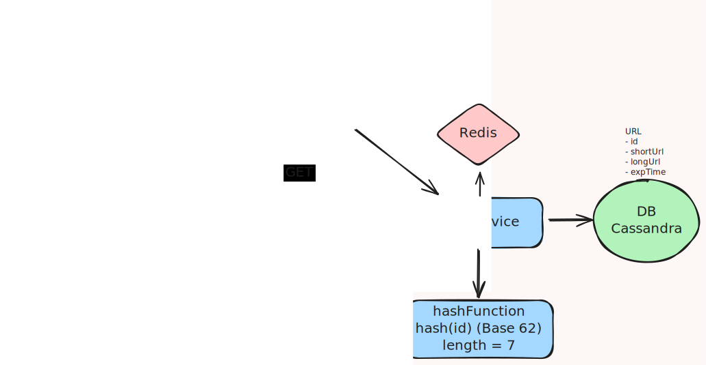

# Design URL Shortener – Link Management

## 📋 Problem Statement

Design a short links with redirection, tracking (like bitly) that can handle:
- Creation of short links from long url
- Redirection of short links to long url
- Expiry of short links
- Customization of short links
- Uniqueness of short links

## 🎯 Functional Requirements

### Core Features
1. **Create a Short Link**: Create a new short link from a long URL.
2. **Short Link Redirection**: Redirect a short link to its corresponding long URL.
4. **Expiry**: Set an expiration date for a short link.
5. **Customization**: Customize the appearance of a short link.
6. **Uniqueness**: Ensure that short links are unique and can be easily identified.

### Non-Functional Requirements
- **Consistency**: High consistency for creating short links
- **Availability**: 99.9% uptime (Availability > Consistency for getting links)
- **Scalability**: Handle large volumes of short links

### Entities:
1. Long URL
2. Short URL

### APIs:
1. Get Long URL
```json
GET /url  >>> 302 longUrl
{
  "shortUrl"
  "expirationTime"  // Optional
}
```

2. Create short URL from long URL
```json
POST /url  >>> shortUrl
{
  "longUrl"
}
```

## 🏗️ System Architecture

### High-Level Architecture



### Core Components

#### 1. **URL Servive**
- Handles creation and redirection of short links
- Handles analytics of clicks on short links
- Handles expiry of short links

#### 2. **Hash Function**
- Converts long URLs to short URLs
- Ensures uniqueness of short URLs
- Uses Base 62 conversion on Id (primary key)

#### 3. **Bloom Filter**
- GET requests are checked against bloom filter
- If the Bloom filter says 'false,' the element is definitely not in the set. If it says 'true,' the element may be in the set, but there's a chance of a false positive.

#### 4. **Redis**
- Handles caching of long URLs and short URLs

## 💾 Data Models

### URL Schema (Cassandra DB)
```javascript
{
  _id: ObjectId,
  longUrl: String,
  shortUrl: String
  expirationTime: Date
}
```

## 🚀 Scalability Considerations

### Horizontal Scaling
- Since everything is stateless,  we can add multiple instances of the URL Service to handle load
- Read vs Write replicas of DB

### Caching Strategy
- Use Redis to cache long URLs and short URLs

## 📚 Additional Resources

- [Youtube](https://youtu.be/AVztRY77xxA?si=9xGcNDkdoZzoMU88)
- [Youtube](https://youtu.be/iUU4O1sWtJA?si=imZLqlQxP4owX2b8)
- [Notes](https://www.hellointerview.com/learn/system-design/problem-breakdowns/bitly)

---

### ⚡️ Follow-up Interview Q&A
---

### Q: What happens if two requests try to generate a short URL for the same long URL at the same time?
- If **idempotency is not enforced**, both could create different short codes for the same long URL. Prefered as storage is cheap.
- Also if **idempotency is enforced**, you can use **unique constraint** on `longUrl` column(extra complexity):
  - Use a **hash(longUrl)** index → if it already exists, return the same short code.  
  - Or accept duplicates but allow users to query existing links.

---

### Q: At 1 billion URLs, how do you partition/shard your DB? By what key?
- Partition by **short code** (hashed prefix) → ensures uniform distribution.  
- Example: `shortCode[0..2]` (first 2–3 chars) decides shard.  
- For Cassandra: partition key = `short_code`.  
- For relational DB: use **consistent hashing** or Citus-style sharding.  

---

### Q: How do you prevent collisions if your random short code generator generates the same code twice?
- Use **unique constraint** on `short_code` column.  
- On collision → retry with a new code.  
- Collision probability is very low with 62^7+ space, but must still handle it gracefully.  

---

### Q: If a short link expires, do you reuse that short code again, or keep it permanently unique? (Pros/cons).
- **Reuse codes**  
  - ✅ Saves space  
  - ❌ Risk of confusion, old links may resurface in logs/analytics  
- **Keep permanently unique (preferred)**  
  - ✅ Safer, no ambiguity in logs/history  
  - ❌ Larger keyspace needed  
- For safety, most real systems **don’t reuse codes**.  

---

### Q: How do you keep cache consistent with DB when a link expires early or is deleted?
- Use **cache invalidation**:
  - On delete/update, **evict Redis key** (`DEL url:code:<short_code>`).  
- Optionally, use **short TTLs** in Redis so stale data self-heals.  

---

### Q: If a user creates a new short URL and immediately tries to use it, but due to replication lag it’s not yet available in all nodes - what happens? Would you choose strong consistency or eventual consistency? Why?
- **Strong consistency (CL=QUORUM)**: Ensures immediate availability, but higher latency.  
- **Eventual consistency (CL=ONE)**: Faster, but link might not resolve instantly.  
- For **redirect path**, availability > consistency. For **creation path**, consistency > availability.  

---