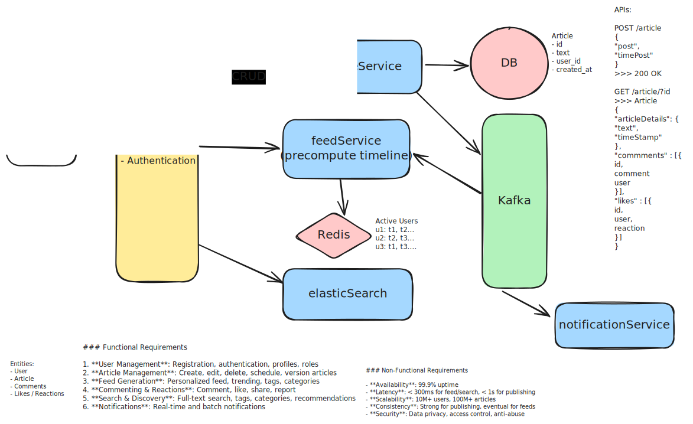

# Design Blogging Platform – Content Management System (CMS)

## 📋 Problem Statement

Design a scalable blogging platform (like Medium, WordPress.com) that allows users to:

- Publish, edit, and delete articles (rich text, images, embeds)
- Comment, like, and share articles
- Follow authors and receive personalized feeds
- Tag, categorize, and search content
- Support drafts, scheduled publishing, and version history
- Ensure high availability, scalability, and security

## 🎯 Functional Requirements

### Core Features

1. **User Management**: Registration, authentication, profiles, roles
2. **Article Management**: Create, edit, delete, schedule, version articles
3. **Feed Generation**: Personalized feed, trending, tags, categories
4. **Commenting & Reactions**: Comment, like, share, report
5. **Search & Discovery**: Full-text search, tags, categories, recommendations
6. **Notifications**: Real-time and batch notifications

### Non-Functional Requirements

- **Availability**: 99.9% uptime
- **Latency**: < 300ms for feed/search, < 1s for publishing
- **Scalability**: 10M+ users, 100M+ articles
- **Consistency**: Strong for publishing, eventual for feeds
- **Security**: Data privacy, access control, anti-abuse

## 🏗️ System Architecture

### High-Level Architecture



### Core Components

#### 1. **API Gateway**

- Entry point for all clients
- Handles authentication, rate limiting, routing

#### 2. **Auth Service**

- User authentication (OAuth, JWT)
- Session management

#### 3. **User Service**

- User profiles, roles, preferences
- Follows, notifications

#### 4. **Article Service**

- CRUD for articles, drafts, scheduling
- Version history, rich text, media embeds
- Tagging, categorization

#### 5. **Feed Service**

- Personalized feed, trending, tags, categories
- Caching for hot feeds
- Pagination, infinite scroll

#### 6. **Comment Service**

- Commenting, likes, shares, reporting
- Moderation, spam detection

#### 7. **Search Service**

- Full-text search, tags, categories
- Indexing and real-time updates

#### 8. **Moderation Service**

- Content moderation, reporting, admin tools
- Automated and manual review

#### 9. **Notification Service**

- Real-time and batch notifications
- Push, email, in-app notifications

#### 10. **Storage Layer**

- SQL/NoSQL for metadata
- S3 for media assets
- Redis for caching

## 💾 Data Models

### User Schema

```json
{
  "_id": "ObjectId",
  "username": "string",
  "email": "string",
  "profilePic": "url",
  "roles": ["author", "editor", "admin"],
  "followers": ["userId1", "userId2"],
  "following": ["userId1", "userId2"],
  "createdAt": "date"
}
```

### Article Schema

```json
{
  "_id": "ObjectId",
  "authorId": "ObjectId",
  "title": "string",
  "content": "string (HTML/Markdown)",
  "tags": ["tag1", "tag2"],
  "categories": ["cat1", "cat2"],
  "status": "draft|published|scheduled|deleted",
  "version": 3,
  "createdAt": "date",
  "updatedAt": "date",
  "publishedAt": "date|null"
}
```

### Comment Schema

```json
{
  "_id": "ObjectId",
  "articleId": "ObjectId",
  "userId": "ObjectId",
  "text": "string",
  "createdAt": "date",
  "likes": 5,
  "replies": ["commentId1", "commentId2"]
}
```

## 🚀 Feed Generation

### Strategies

- Personalized feed: Followed authors, tags, categories
- Trending: Most read, liked, commented
- Caching for hot feeds (Redis)
- Pagination, infinite scroll

## 🔒 Security & Moderation

### Authentication & Authorization

- OAuth2, JWT for user auth
- Role-based access control (author, editor, admin)
- Rate limiting, anti-abuse

### Data Protection

- Encryption at rest and in transit
- Secure media URLs (signed URLs, expiry)
- Moderation for comments, articles

### Privacy

- User-controlled privacy settings
- GDPR compliance

## 📊 Performance Optimization

### Feed

- Precompute feeds for active users
- Use Redis for hot feed caching
- Efficient pagination (cursor-based)

### Search

- Elasticsearch for indexing
- Autocomplete, trending queries

### Storage

- S3 for media assets
- CDN for global delivery
- Shard DBs by user/article

## 📚 Additional Resources

- [Medium Engineering Blog](https://medium.engineering/)
- [WordPress.com Engineering](https://developer.wordpress.com/)
- [Elasticsearch for Search](https://www.elastic.co/)
- [Content Moderation](https://www.microsoft.com/en-us/research/project/content-moderation/)
- [CDN for Media Delivery](https://aws.amazon.com/cloudfront/)

---
