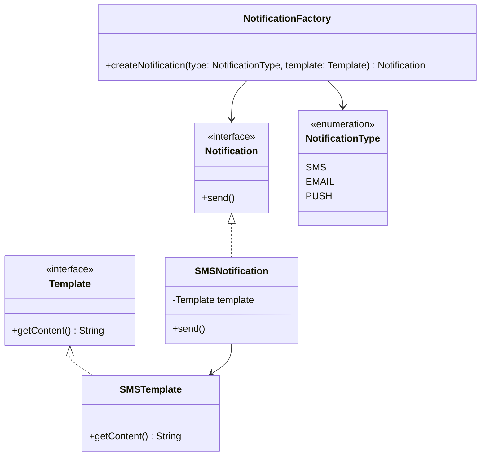

# 📢 Notification Service (LLD)

This project demonstrates a **Low-Level Design (LLD)** of a Notification Service using Java.  
The design follows **OOP principles** and emphasizes extensibility for supporting multiple types of notifications (e.g., SMS, Email, Push).

---

## 🚀 Features
- **Notification Interface** → Defines the contract for all notifications.
- **Template Interface** → Defines the contract for notification templates.
- **SMS Notification** → Example implementation of sending SMS notifications.
- **SMS Template** → Concrete implementation of a template for SMS messages.
- **NotificationType Enum** → Enum to define supported notification types.
- **NotificationFactory** → Creates notification objects dynamically based on type.
- **Main Class** → Entry point to demonstrate the flow.

---

## 📂 Project Structure

```
Notification/
┣ Main.java
┣ Notification.java          # Interface for notifications
┣ NotificationType.java      # Enum for notification types
┣ Template.java              # Interface for templates
┣ SMSNotification.java       # SMS notification implementation
┣ SMSTemplate.java           # SMS template implementation
┣ NotificationFactory.java   # Factory to create notifications
┗ Readme.md
```

---

## 🏗️ Class Diagram (Mermaid UML)



### 🧩 Extensibility
- Add EmailNotification + EmailTemplate for emails.
- Add PushNotification for push notifications.
- Extend NotificationType enum as new types are added.
- Factory ensures new types can be plugged in without modifying existing code.

---

### ✅ Key Design Principles
- Factory Pattern → Encapsulates object creation, improves maintainability.
- Interface Segregation → Separate contracts for templates and notifications.
- Open/Closed Principle → Open for extension (new notification types) but closed for modification.
- Dependency Injection → Notifications depend on abstract templates, not concrete ones.

---